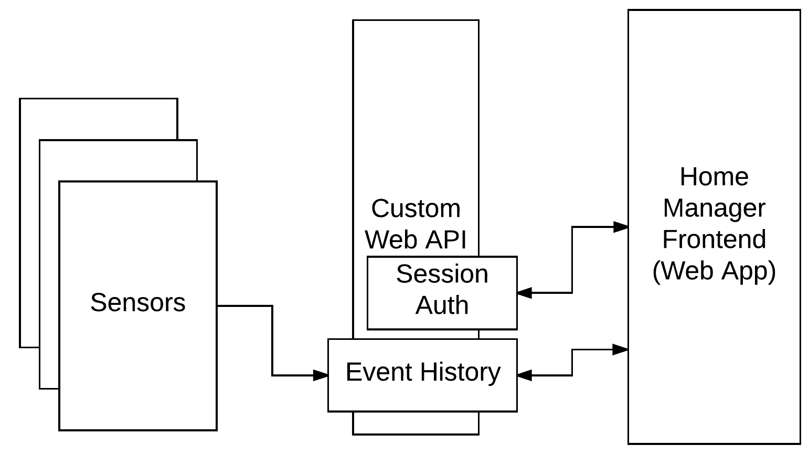
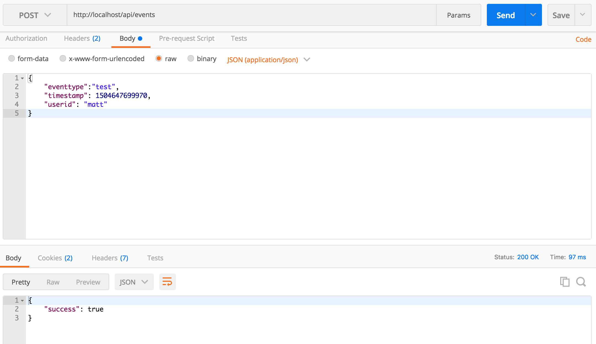

# Building a Server

### Cybersecurity First Principles in this lesson

* __Abstraction__: An abstraction is a representation of an object or concept. It could be something such as a door, a speedometer, or a data structure in computer science. Abstraction decouples the design from the implementation. The gauges in an automobile are an abstraction of the performance of a car. A map is an abstraction of the earth.

* __Data Hiding__: Data hiding is the technique that does not allow certain aspects of an object to be observed or accessed. Data and information hiding keeps the programmer from having complete access to data structures. It allows access to only what is necessary.

* __Layering__: Cyber security uses multiple layers of defense or protecting information. If one layer is defeated the next layer should catch it.

* __Least Privilege__: One of the ways to protect information is by limiting what people can see and do with your information and resources. The principle of least privilege says to allow the minimum number of privileges necessary to accomplish the task.

* __Minimization__: Minimization refers to having the least functionality necessary in a program or device. The goal of minimization is to simplify and decrease the number of ways that software can be exploited. This can include **turning off ports that are not needed**, reducing the amount of code running on a machine, and/or turning off unneeded features in an application.

* __Modularization__: The concept of modularity is like building blocks. Each block (or module) can be put in or taken out from a bigger project. Each module has its own separate function that is interchangeable with other modules.

* __Resource Encapsulation__: Encapsulation is an object oriented concept where all data and functions required to use the resource are packaged into a single self-contained component. The goal is to only allow access or manipulation of the resource in the way the designer intended. An example, assume a flag pole is the object. There are fixed methods on how the flag pole is to be used. Put the flag on, take the flag off, raise or lower the flag. Nothing else can be done to the flag pole.

* __Simplicity__: Simplicity allows a person to better understand hardware and software. Without the clutter of unnecessarily complicated code and interfaces, the software will be more understandable by people that will update the code when requirements change. It will be easier to understand by the testers and they will be able to spot problems sooner. By keeping software as simple and as focused as possible, the reliability and security is greatly increased.

### Introduction
In this module, you will learn how to build a server of your own and connect it up to Littlebits.

### Goals
By the end of this tutorial, you will be able to:
* Build and deploy a `Django` server into a `container`
* Create a `REST endpoint` on the `application server`


### Materials Required
For this lesson, you will need:

* PC or Mac with Docker
* Internet connection

### Prerequisite lessons
You should complete the following lessons before attempting this lesson.
* [Web Services and REST](../restful-api/README.md)
* [Containers](../containers/README.md)

### Table of Contents
<!-- TOC START min:1 max:3 link:true update:true -->
- [Building a Server](#building-a-server)
    - [Cybersecurity First Principles in this lesson](#cybersecurity-first-principles-in-this-lesson)
    - [Introduction](#introduction)
    - [Goals](#goals)
    - [Materials Required](#materials-required)
    - [Prerequisite lessons](#prerequisite-lessons)
    - [Table of Contents](#table-of-contents)
    - [Step 1: Review - Where are we so far?](#step-1-review---where-are-we-so-far)
    - [Step 2: No, you won't be starting from scratch](#step-2-no-you-wont-be-starting-from-scratch)
    - [Step 3: Setup the server](#step-3-setup-the-server)
    - [Step 4: Run the server](#step-4-run-the-server)
    - [Step 5: Explore the server](#step-5-explore-the-server)
    - [Step 6: Press the button](#step-6-press-the-button)
    - [Step 7: Chrome Dev Tools - Your new best friend](#step-7-chrome-dev-tools---your-new-best-friend)
    - [Step 8: Make a new REST endpoint to make the client button work with the backend](#step-8-make-a-new-rest-endpoint-to-make-the-client-button-work-with-the-backend)
    - [Step 9: Profit!](#step-9-profit)
    - [License](#license)

<!-- TOC END -->


### Step 1: Review - Where are we so far?
We saw how `containers` could be used to host `isolated` servers on another host machine.

Now, in this lesson, we will examine how to create our own server and deploy it in a container.

For reference, this is the overall design we are looking at. On the left side, you have some sensors - they could be anything, since this isn't an IoT class, we can just assume we are getting data from them. In this lesson, we will begin building the item marked `custom web API` in the figure below. It will have features to support authentication, logging events, and we can even include a hook to trigger another service (like `IFTTT`).


### Step 2: No, you won't be starting from scratch
The process of creating a new application server from the ground up takes some time and attention. Instead of having you start from the ground up, I'll provide you with some **starter** skeleton code. This code does the basics - you will extend it to accepting requests, store the data that comes in, and then trigger another service.

* First, `fork` the repo for this lab by visiting the https://github.com/MLHale/CYBR8470-building-a-webservice-lab and clicking 'fork'. This will copy the code from our repository into your GitHub account - so you can track your changes as you go.
* Since this project includes a `submodule` that you will edit, you need to fork it as well. Visit https://github.com/MLHale/CYBR8470-building-a-webservice-lab-backend and click `fork`.
* Let's get started locally on your machine by changing into the Desktop directory and then using `git` to clone the skeleton code repository and get it in onto our local machine.

Open a new `Powershell terminal instance:

```bash
cd Desktop
git clone https://github.com/<your-github-id without the brackets>/CYBR8470-building-a-webservice-lab
cd CYBR8470-building-a-webservice-lab/
```

Add the folder to your `Atom` workspace.

Open the `.gitmodules` file. Edit the `backend` submodule to point to your forked copy, instead of the base repo.

```
[submodule "backend"]
	path = backend
	url = https://github.com/MLHale/CYBR8470-building-a-webservice-lab
[submodule "frontend"]
	path = frontend
	url = https://github.com/MLHale/CYBR8470-building-a-webservice-lab-frontend
```

becomes

```
[submodule "backend"]
	path = backend
	url = https://github.com/<your-github-id without the angled brackets>/CYBR8470-building-a-webservice-lab-backend
[submodule "frontend"]
	path = frontend
	url = https://github.com/MLHale/CYBR8470-building-a-webservice-lab-frontend
```

This command tells git to use the new url as the path for the submodule. To pull down the code run the following (in the terminal/powershell):

```bash
git submodule sync
git submodule update --init --recursive --remote
cd backend/
git checkout master
git checkout -b my-work
git push --set-upstream origin my-work
cd ..
git add -A
git commit -m "updated to forked submodule repository"
git push
```

This should checkout the code for the start of this lesson and create a new branch called `my-work`. It also updates the `CYBR8470-building-a-webservice-lab-backend` repository you forked to include the correct pointer to the new forked submodule. You should also see your file tree in `Atom` update. Any new updates you make you can always run the commands `git add`, `git commit`, and `git push` to save your changes in the branch to your remote repo.

For now, we have our code ready.
Now use `docker` to build the `image` that our container will use, from the `CYBR8470-building-a-webservice-lab-backend` directory:

```bash
docker-compose build
```

With this, we should be able to type the following and see our new image.

```bash
docker images
```
It will be called something like `CYBR8470-building-a-webservice-lab-backend_django`.

### Step 3: Setup the server
This server is completely new, so we need to do some setup to get it initially configured. Execute the following to run the server and open up a bash terminal to interact with it.

```bash
docker-compose run django bash
```

In this terminal that opens in the container, we need to tell our `Django` server to setup the database and create a new user account for us. The first two lines below setup the database by creating a `database Schema` that our SQL server can use to store data. The third line creates a new superuser account. Specify a password for admin. In development, you can use something simple (e.g. admin1234) for simplicity. In practice, you would want to use a much more secure password - since the server could be accessed from the wider internet.

```bash
python manage.py makemigrations
python manage.py migrate
python manage.py createsuperuser --username admin --email admin
exit
```

* Now open `Atom` on your desktop,
* go to the File -> "Add Project Folder..."

<!-- 
> note that your interface may look slightly different on windows. -->

* Find your `CYBR8470-building-a-webservice-lab-backend` folder (it should be located at `C:/Users/student/Desktop/`)
* Upon opening it you should see the file tree of the folder structure.

<!--  -->

Now, in `Atom`, open the `/CYBR8470-building-a-webservice-lab-backend/backend/django_backend/settings.py` file by navigating to it in the file tree (on the left) and clicking it.

find the line marked:
```
ALLOWED_HOSTS = ['137.48.185.230', 'localhost']
```
Replace '137.48.185.230' with your `ip address`.

* to get your server ip, you need to open a `Powershell` and type (use `ifconfig` instead for Mac/Linux):
```bash
ipconfig --all
```
* find your ipv4 address on the ip record for the ethernet card attached to your machine
* alternatively, you can go to http://google.com and search for 'my ip address'


### Step 4: Run the server
With the database initialized, you should be able to easily run the app. All you need to do is:

```bash
docker-compose up
```

This server, diagrammatically looks like:


The docker command executes the container using the `docker-compose.yml` file located in your `/CYBR8470-building-a-webservice-lab-backend/` folder.
* Leave this terminal running
* It works by mapping `port 80` on the `host` to `port 8000` in the container.
* Inside the container, Django executes its `runserver` utility - which works like a web server.
* There is also a second container that starts up and runs our `postgres` database server.
* You can take a look at the `Dockerfile` in your `/CYBR8470-building-a-webservice-lab-backend/` folder to learn more about what happens behind the scenes.

With the server running, you should be able to visit [http://localhost](http://localhost) to see your server. You should an interface that looks something like the following.  

<!--  -->

This is a `web client` (also called a `frontend`) that I've built for demo purposes to work with our server. You will be making the server work with the client. I've included the client code in the `/frontend` folder, but you won't need to modify it for this lab. Later labs will deal with client-side development.

### Step 5: Building the server event API endpoint
Since our focus is the `backend` - lets take a look at our server environment. First. Lets explore the file tree.

* click `backend` in the file tree to explore the actual files our server is using
* Click `api` and `django_backend` to expand out the folders and see what we have.
* This code is built using a `Model View Controller` framework called `Django`.
  * `Models` (in `models.py`) are `abstraction` mechanisms that help you represent your data without worrying about the nitty gritty of database technologies.
  * `Controllers` (in `controllers.py`) and `Views` are modularization mechanisms that separate user-facing code (like user interfaces) from backend code that handles number crunching and getting data to the views.
* Look over these three files, first `models.py`, then `urls.py`, then `controllers.py`

#### Models.py
* In `models.py` you will see that we have defined two `models`: `Event` and `ApiKey`. Both of these are `schema` that have fields in them for each of the types of data they hold.
* In our `ApiKey` model we have fields for the `owner` and the actual `key`. These will hold our IFTTT key that we will use later to communicate with IFTTT via `webhooks`.
* We have also provided an `Admin` class that lists out the fields. This is used by Django's admin interface to display the data for management.

```python
class ApiKey(models.Model):
    owner = models.CharField(max_length=1000, blank=False)
    key = models.CharField(max_length=5000, blank=False)

    def __str__(self):
        return str(self.owner) + str(self.key)

class ApiKeyAdmin(admin.ModelAdmin):
    list_display = ('owner','key')
```

* In the `Event` model we have fields for:
  * the `eventtype` which describes what occurred,
  * `timestamp` (when it happened)
  * `userid` which is the id of the user
  * and `requestor` which logs the IP of the client that sent the message

```python
class Event(models.Model):
    eventtype = models.CharField(max_length=1000, blank=False)
    timestamp = models.DateTimeField()
    userid = models.CharField(max_length=1000, blank=True)
    requestor = models.GenericIPAddressField(blank=False)

    def __str__(self):
        return str(self.eventtype)

class EventAdmin(admin.ModelAdmin):
    list_display = ('eventtype', 'timestamp')
```

* Both of the models also include a `__str__` function which outputs a string if the model is converted to a string.

#### urls.py
Next lets look at `urls.py`. This file tells Django which URLs are accessible on the server. If a URL entry isn't included in a `urls.py` file, then the method cannot be accessed.

* The important part of this file, below, identifies all of the `url patterns` that are acceptable for `Django` to server up to any would-be requestors
* Each is a regular expression.
* Each maps to a function in the `controllers.py` file. Basically, when someone attempts to visit a URL, Django goes through its list of acceptable patterns. If it matches a pattern it executes the corresponding code in that method. If it doesn't match any acceptable pattern, it gives the user an `HTTP 404` error (not found).
* in this case, `api/urls.py` is a sub set of patterns that are mapped behind `/api/` as given in the file `django_backend/urls.py`.

**api/urls.py**
```python
urlpatterns = [
    url(r'^session', csrf_exempt(controllers.Session.as_view())),
    url(r'^register', csrf_exempt(controllers.Register.as_view())),
    url(r'^', include(router.urls)),
]

```

**django_backend/urls.py**
```python
urlpatterns = [
    url(r'^admin/', admin.site.urls),
    url(r'^api-auth/', include('rest_framework.urls', namespace='rest_framework')),
    url(r'^api/', include(api_urls)),
    url(r'^xss-example/', controllers.xss_example),
    url(r'^', controllers.home),
]
```

#### Controllers.py
Next, lets look at the `controllers.py` file to see what the server does when a URL is visited.

There is some code in this file that handles session-based authentication and registration, but we need to create more code to make this app work.

Specifically the client is trying to retrieve events, so it can display them accordingly in the app. We need an `API endpoint` that handles requests to the `/api/events` URL.

Inspect the network console to see the requests the client is making.


 > Notice it is making a request to /api/events/ and getting a 405 Method not allow error - because our API does not support this endpoint.

* We can fix this by adding a new `class` that extends the Django REST class `APIView` to implement our endpoint.
* An `APIView` allows you to define functions that handle `GET` (single), `GET`(list), `POST`, `PUT`, and `DELETE` requests that might arrive at `/api/events`
* The `GET` (single) request is used whenever a user wants to get a single item (typically by id), something like `/api/events/4` would return the event with id 4.
* The `GET` (list) request is used whenever a user wants to get all of the events.
* The `POST` request is used whenever a user wants to make a new event.
* The `PUT` request is used whenever a user wants to modify an existing event.
* Finally, the `DELETE` request is used whenever a user wants to delete an existing event.

> These conventions are not specific to `Django` they are based on `RESTful API` design standards.

* In our `APIView` we need to create two `REST endpoints` for handling `POST` requests and `GET` (list) requests.

* The `post` function looks at the incoming request, extracts the data fields from it, and then creates and stores a new `Event` record based on the incoming request data. IF we were working with a real app, another sensor or service could call this endpoint and store data about an event that occured.

* The `get` function simply queries the database for all `Event` objects and returns them to the requestor in `JSON` format

```python
class Events(APIView):
    permission_classes = (AllowAny,)
    parser_classes = (parsers.JSONParser,parsers.FormParser)
    renderer_classes = (renderers.JSONRenderer, )

    def post(self, request, *args, **kwargs):
        print 'REQUEST DATA'
        print str(request.data)

        eventtype = request.data.get('eventtype')
        timestamp = int(request.data.get('timestamp'))
        userid = request.data.get('userid')
        requestor = request.META['REMOTE_ADDR']

        newEvent = Event(
            eventtype=eventtype,
            timestamp=datetime.datetime.fromtimestamp(timestamp/1000, pytz.utc),
            userid=userid,
            requestor=requestor
        )

        try:
            newEvent.clean_fields()
        except ValidationError as e:
            print e
            return Response({'success':False, 'error':e}, status=status.HTTP_400_BAD_REQUEST)

        newEvent.save()
        print 'New Event Logged from: ' + requestor
        return Response({'success': True}, status=status.HTTP_200_OK)

    def get(self, request, format=None):
        events = Event.objects.all()
        json_data = serializers.serialize('json', events)
        content = {'events': json_data}
        return HttpResponse(json_data, content_type='json')

```
* There is a fair bit of code here, so lets break it down. The first three fields sets some parameters to allow this endpoint to be accessible and parsed using a form parser and then displayed using the JSON renderer. If we look at `Django REST Framework` each of these items is defined. They are unimportant, at the moment.
* Below this, we see the `GET` method that we need to support our client.
  * This method makes a database `Query` using Django's Database management system (DBMS) to get all of the events..e.g. `Event.objects.all()`
  * Once retrieved, the events are serialized as json using a supporting JSON library loaded in python.
  * These JSON-serialized events are then dropped into a json object called `events` (which is what our client was expecting).
  * These events are returned back to the client.
  * Go ahead and add this method in and save the file.

* Below the `GET` request handler, we also have a `POST` handler.
  * This takes in a request, parses out the data, and saves a new event to our database of events.
  * It uses the request's header data (in request.META) to log the IP of the user making the request.
  * If the data conforms to our validations, the new event is saved and a response message is returned. Otherwise, if the request is malformed, we send a `BAD_REQUEST` error response.

* Now that our methods for this endpoint are defined, we need to now create a URL to expose the endpoint to the web.
* open `api/urls.py` and edit it to look like the following:

**new api/urls.py**
```python
urlpatterns = [
    url(r'^session', csrf_exempt(controllers.Session.as_view())),
    url(r'^register', csrf_exempt(controllers.Register.as_view())),
    url(r'^events', csrf_exempt(controllers.Events.as_view())),
    url(r'^', include(router.urls)),
]

```

* This tells Django to serve our new endpoint in controllers.py at the url `api/events`
* now refresh the app
* examine the console and notice that the GET requests are now succeeding, but no data is being returned.
* in your browser, navigate to `chrome://apps/` and launch `POSTMAN`
* Craft a request that looks like the following:



* Now revist http://localhost and refresh the page. Do you see your event?
* Try posting some more from POSTMAN. It auto-refreshes!
* Well thats neat. What about that other button in the app though to turn IFTTT on?

#### Checkpoint
1. Is the URL `<myserver>/api/events` a valid URL?
1. Is the URL `<myserver>/api/session` a valid URL?
1. What function gets called when the user visits `<myserver>/api/register`?
1. What would be the result of making a `DELETE` request to `<myserver>/api/events`?
1. What would be the result of making a `POST` request to `<myserver>/api/events`?

### Step 6: Press the button
Ok, so you now have a loose familiarity with the skeleton `backend` code that was provided to you. Lets build some more upon it.

When you login, you should see a green button that says **turn IFTTT on** when visiting `localhost`. Time to push it!


* in your browser, go to http://localhost
* press the UI button
* what happened?
* How can we tell?

Lets use the `chrome development tools` to take a closer look.

* Press F12 (windows) or Right Click on the page -> Select `Inspect`
* This will bring up the `chrome development tools` which have a number of very helpful capabilities for debugging websites and inspecting the behind-the-scenes action that happens when you interact with web content

### Step 7: Chrome Dev Tools - Your new best friend
Instead of me reinventing the wheel, head over to [https://developers.google.com/web/tools/chrome-devtools/](https://developers.google.com/web/tools/chrome-devtools/) to learn the basics of what Chrome Development tools can do.

When you've looked over the different features. Come back and click on the `network` tab to inspect what is happening with our button.


* If you click on `activateIFTTT` you will see the exact request that is getting sent.
* You should see a similar error to  `method not allowed` like we saw before. This is because we haven't actually defined or enabled the activateIFTTT endpoint on the server-side yet. We will do that next.
* If you click over to the `response` tab you will see the raw response that the server is returning when this button is clicked.

### Step 8: Make a new REST endpoint to make the client button work with the backend
Currently, the server doesn't know that it needs to do anything special with the URL `/api/activateIFTTT` so it is just rendering the home page (what we have been looking at this whole time) in response. What we need is for our server to **recognize that a new event has occurred** from the client and then **do something to handle it**, in this case, contact `IFTTT`.

For this to work, we need to create a new REST Endpoint controller to handle the request. Open up your `controllers.py` file and add a new entry called `ActivateIFTTT`. This entry will only expose a `POST` endpoint. The goal is to:

* capture the info from the client
* Retrieve the stored API Key for IFTTT
* Turn on the a webhook named `test` and log the resulting event locally

```python
class ActivateIFTTT(APIView):
    permission_classes = (AllowAny,)
    parser_classes = (parsers.JSONParser,parsers.FormParser)
    renderer_classes = (renderers.JSONRenderer, )

    def post(self,request):
        print 'REQUEST DATA'
        print str(request.data)

        eventtype = request.data.get('eventtype')
        timestamp = int(request.data.get('timestamp'))
        requestor = request.META['REMOTE_ADDR']
        api_key = ApiKey.objects.all().first()
        event_hook = "test"

        print "Creating New event"

        newEvent = Event(
            eventtype=eventtype,
            timestamp=datetime.datetime.fromtimestamp(timestamp/1000, pytz.utc),
            userid=str(api_key.owner),
            requestor=requestor
        )

        print newEvent
        print "Sending Device Event to IFTTT hook: " + str(event_hook)

        #send the new event to IFTTT and print the result
        event_req = requests.post('https://maker.ifttt.com/trigger/'+str(event_hook)+'/with/key/'+api_key.key, data= {
            'value1' : timestamp,
            'value2':  "\""+str(eventtype)+"\"",
            'value3' : "\""+str(requestor)+"\""
        })
        print event_req.text

        #check that the event is safe to store in the databse
        try:
            newEvent.clean_fields()
        except ValidationError as e:
            print e
            return Response({'success':False, 'error':e}, status=status.HTTP_400_BAD_REQUEST)

        #log the event in the DB
        newEvent.save()
        print 'New Event Logged'
        return Response({'success': True}, status=status.HTTP_200_OK)

```

Now that we have the endpoint defined we need to make it available on the web server. Modify `api/urls.py` to include a new line in the `urlpatterns`, make it look like:

```python
urlpatterns = [
    url(r'^session', csrf_exempt(controllers.Session.as_view())),
    url(r'^register', csrf_exempt(controllers.Register.as_view())),
    url(r'^events', csrf_exempt(controllers.Events.as_view())),
    url(r'^activateifttt', csrf_exempt(controllers.ActivateIFTTT.as_view())),
    url(r'^', include(router.urls)),
]
```

This will make the endpoint available on the webserver. Now go back to http://localhost and try to click the button. What happens?

Did you get an error?

This is because we haven't added our `API Key` to our server, so the field `api_key = ApiKey.objects.all().first()` returns null (or `NoneType`). To fix this, open your browser and go to http://localhost/admin/api/apikey/. Click 'add api key'.

* Then enter your username (probably `admin`) in the `owner` field.
* In the `key` field add in your `IFTTT` API key.
  * To get that, you need to register for an IFTTT account here: [https://ifttt.com](https://ifttt.com).
  * Once signed up, go to: [https://ifttt.com/maker_webhooks](https://ifttt.com/maker_webhooks) to enable webhooks.
  * Once enabled, go to [https://ifttt.com/services/maker_webhooks/settings](https://ifttt.com/services/maker_webhooks/settings).
  * Your API Key is the part that comes in the url after `https://maker.ifttt.com/use/`
* we also need to create a new webhook applet named `test` to receive our events.
  * go to: [https://ifttt.com/create](https://ifttt.com/create)
  * for the `IF` condition select `webhook`
  * For the `then` condition you can have IFTTT send you an email or any number of other events. Pick one. When done, save the applet.

* Now go back to your app at localhost and click the green button. What happened?


* Since you made some changes to your code repository, lets track the changes with `git`:

* in a terminal change directory in the the `/backend` folder and execute the following:

```bash
git status
git add -A
git status
git commit -m "added endpoints for events and IFTTT"
git push
```

You just pushed your local changes to `remote` on `github`!

#### Stray observations
* Our new endpoints are each individual `modules` that exemplifies the `modularization` Cybersecurity First Principle. They don't rely on the other modules (endpoints).
* We did not hardcode our `API key` in the code to protect it from static lookup - this is an example of the `information hiding` Cybersecurity First Principle.
* We made use of `abstraction` and `resource encapsulation`.
* We've made our first `web service`!

### Step 9: Profit!
Pretty neat. Observe your handy work.


### License
Lesson content: Copyright (C) [Dr. Matthew Hale](http://faculty.ist.unomaha.edu/mhale/) 2017.  
<a rel="license" href="http://creativecommons.org/licenses/by-nc-sa/4.0/"></a><br /><span xmlns:dct="http://purl.org/dc/terms/" property="dct:title">This lesson</span> is licensed by the author under a <a rel="license" href="http://creativecommons.org/licenses/by-nc-sa/4.0/">Creative Commons Attribution-NonCommercial-ShareAlike 4.0 International License</a>.
