## Github Primer

### Cybersecurity First Principles
* __Domain Separation__: Good fences make good neighbors. When trying to secure a home or computer, separating the areas where resources are and people work prevents accidents and loss of data or private information. We are preventing the information worlds from colliding. This lesson focuses on using development tools such as Github to manage different environments (such as development and production) effectively.

* __Modularization__: The concept of modularity is like building blocks. Each block (or module) can be put in or taken out from a bigger project. Each module has its own separate function that is interchangeable with other modules

* __Least Privilege__: One of the ways to protect information is by limiting what people can see and do with your information and resources.

[Git](https://git-scm.com/) is a popular software development tool used by developers to collaborate and version control code. It is, however, not limited to just code. You can, and many others already do, use it as a collaborative enviroment to develop other written works. The most popular online platform to host public git repositories is a site called [Github](www.github.com). For our lessons here, we will use Github, but do note that there are several other services, such as [BitBucket](https://bitbucket.org/), that also provide git and other version control repository hosting capabilities. The following tutorials focus on how you can use Git and Github for collaboration and version control.

### Table of Contents    
[Step 1: Create Account](#step-1)  
[Step 2: Hello World](#step-2)  
[Step 3: Clone Repository](#step-3)  
[Step 4: Push Changes](#step-4)  
[Step 5: Pull Remote Changes](#step-5)  
[Step 6: Fork Repository](#step-6)  
[Step 7: Pull Request](#step-7)  
[Step 8: Markdown](#step-8)   
[Cyber security First Principle Reflections](#cyber-security-first-principle-reflections)  
[Additional Resources](#additional-resources)


### Step 1
First things first, create a free account on Github. https://github.com/join
You will also need to verify your email address after registration in order to use your new github account.

[Top](#table-of-contents)

### Step 2
Complete the following Github tutorial:
https://guides.github.com/activities/hello-world/

At the end of the Hello World Step 2, you will have created a **Remote** repository and will have added a `branch`. It is `remote` because all your files are in the Github cloud. As a developer, you might ask, "how do I use this to create code if it is just online?" It is not convenient to write and test code online, especially when many applications require locally install packages to even work. It would be great to use your own **Local** repository. We will do just that in the next step.

[Top](#table-of-contents)

### Step 3
To create a **Local** repository there are two basic options.
1. Clone a remote repository on your computer, or
2. Initialize a new git repository from scratch on your computer.

[Top](#table-of-contents)

##### Clone a remote repository
Let's start by looking at option #1. Git tools do not come pre-installed with all operating systems. To check if they exist on your operating system, open up a command line interface and type `git`. If Git is installed, this command will give you some help options. If the command is not recognized, then it means you need to install git on your OS. The information available at [https://git-scm.com/book/en/v2/Getting-Started-Installing-Git](https://git-scm.com/book/en/v2/Getting-Started-Installing-Git) can walk you through it for a variety of OSes.

For an Ubuntu Desktop OS like the one you created in the `Virtualization` module, the instructions you need to type in a terminal are below. To open a new terminal in the Ubuntu VM you created earlier, press ctrl + alt + t.

```bash
sudo apt-get update
sudo apt-get -y install git
```
The `-y` option automates the installation by responding YES to any prompts. After the installation succeeds, type `git` to see various command options. To clone a remote repository (what we set out to do), we first need a reference URL to find it. On Github.com, navigate to your hello-world repository and click on the button that says `Clone`. Copy that URL.

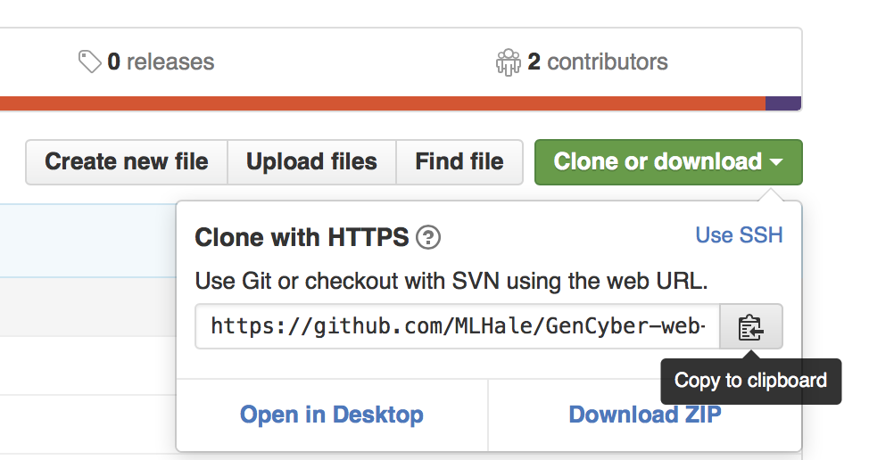

Now we are ready to clone this remote repository, and create a local repository. To do this we will use the `git clone <repository URL>` command. In the command below use the URL you copied above by pressing the `Clone` button.

```bash
git clone <replace this with the clone URL that you copied above>
```
You will start to see some download messages and upon success, your local repository will be ready for use. You will also be asked to authenticate.

Now switch to the hello-world directory that has all the files from the repository that you just cloned.

```bash
cd hello-world/
```

To list the files in this directory, use this command

```bash
ls
```
You should see a README.md and possibly some other files.

##### Initialize a new repository

> We do not need to use this option currently, so you may move to [Step 4](#step-4)

If you need to create a new repository you would just navigate to the folder (using the `cd` command) containing the files you wish to version control and then use the init command: `git init`. That's it! This is useful if you are creating new files from scratch. Using github, you can also push newly tracked files such as these to a remote repository. The steps are the same as you will see for cloned respositories below.

[Top](#table-of-contents)

### Step 4
In this step we will make changes to files in our Local repository and then `push` changes back to the remote repository.

Git is based on a "de-centralized" model of ownership - which means that there is no central authoritative repository. Every repository, Local or Remote, is fully autonomous and fully functional on its own. So changes made in any repository are tracked in that repository only. Two repositories do not communicate unless there is a explicit request to synchronize changes across them. This will make more sense as we work through a scenario.

Let's open the hello-world folder in the Ubuntu Desktop OS VM and make changes to the `README.md` file in a text editor.  

1. Navigate to the files
>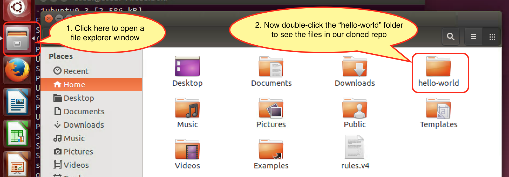

2. Open README.md by double-clicking it
>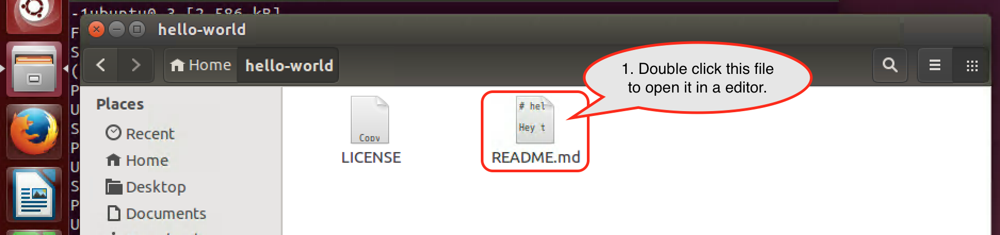

3. Edit README.md to add a message. Like the one below.
>

Once you save the edited README.md, check the status of the local repository using the following command. Make sure you navigate to a folder within your repository in the terminal first.

```
git status
```
You should see something like this:

>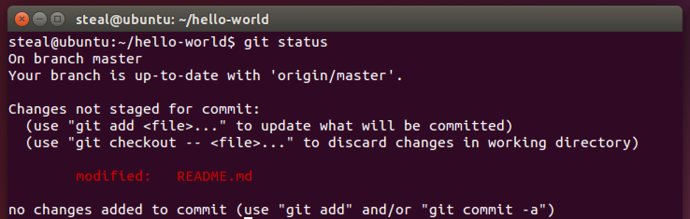

A few things to notice here about these status messages:  
1. `On branch master`: You are on the master branch in your local repository.  
2. `Your branch is up-to-date with 'origin/master'`: Your local repository master branch is in sync with your remote repository master brach on Github. The default name for the remote repository is **origin**.  
3. `Changes not staged for commit:`: git follows a two step process to save changes to a repository. First the user indicates which modified/deleted/new files need to be _staged_ for a save in the repository. Second these staged files are _committed_ to the repository. We will look at commands to do both of these shortly.  
4. `modified:   README.md`: git knows that the README.md file has been modified  

Now we stage our changes for a commit using this command:
```bash
git add --all
```
The above command adds any edited files in a staging area, a temporary holding place before a commit. We can check the status of the repository again using the following command:

```bash
git status
```
You should see something like this:

>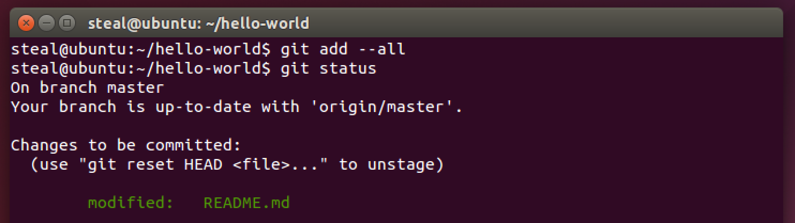

This time the modified files are staged for a commit and appear in green.

Now before we **commit** these files into our repository, the git author details need to be set. This is for accountability of commits. Using the commands below, save your information to the git configuration files and set them for all of your local repositories. Make sure to use the same name and email you used to register with Github.

```bash
git config --global user.name "replace this with your name"
git config --global user.email youremail@example.com
```
You should see something like this:
>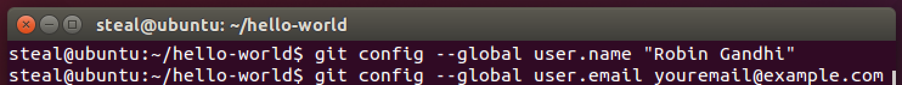

Check your configuration changes by using the following command:
```bash
git config --list
```
You should see something like this:
>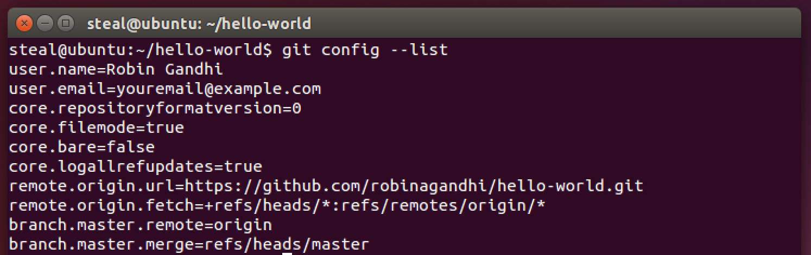

You only have to set the config parameters once. Now that they are set, git will keep reusing them when making commits or merging your changes with other repositories.

Now let's commit the changes that we staged before. Here we use the `commit` option with `-m` to provide a short commit message. This helps us remember various checkpoints in our editing process. These messages are very helpful to rollback changes to an appropriate commit.

```bash
git commit -m "added UNO description"
```
You should see something like this:
>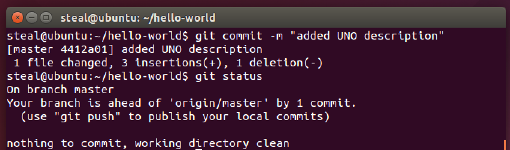

Use this command to see all your commits:
```bash
git log
```
This command shows a summary of commits in the repository, stating with the most recent. Observe the hash code, user details and commit message. These attributes provide attribution of all changes in the code repository, promoting code integrity.  
> Hit the key `q` to exit the log of commit messages.

Issue this command to check your repository status once again:
```bash
git status
```
It should report **no** uncommitted changes. But it indicates that `Your branch is ahead of 'origin/master' by 1 commit`. Which means that our local repository master branch has more recent commits than the remote repository master branch.

To push our local commits to the remote repository, we need the git `push` command. With this command we need to indicate the name of the remote repository followed by the name of the local repository branch that has updates to be pushed. Do you remember the name of our remote repository and the main branch?

> #### Questions
> What is the default name of the remote repository?  
> What is the name of the main branch in our local repository?

To push local commits to the remote repository, use the following command:

```bash
 git push origin master
```
You should see something like this:
>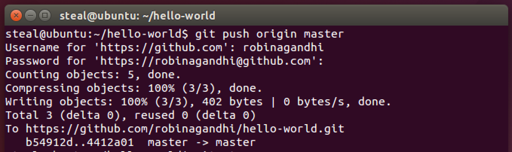

Issue this command to check your repository status once again:
```bash
git status
```
You should see something like this:
>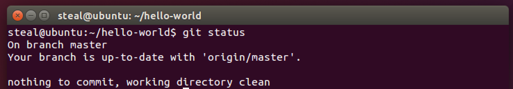

If you visit your remote repository on Github.com your changes will be reflected there. You should also see your commit message there. Clicking on the commit message will show the file differences in that commit.


As mentioned before in the introduction, git version control is very efficient for text files. It does not store entire files for old versions but only the differences. So it is prudent to make frequent commits and then push these changes to the remote repository - so that you have as many checkpoints as possible should you need to roll back.

[Top](#table-of-contents)

### Step 5
What happens if we make some changes to README.md on Github.com? How do we get these changes back into our local repository. We will learn just that in this step.

So, I realized that I forgot to add a link to UNO's Cybersecurity programs in the README.md file. So I will make these changes and commit those changes on Github.com itself.

1. First click on README.md file on Github and then click the edit option as shown below:
>

2. Make changes, add a commit message and click `Commit changes`
>

3. See changes in your README.md file
>

Now the remote repository is one commit ahead of the local repository. To bring the _local_ repository up to speed, we use the following command in a terminal.

```bash
git pull
```
You should see something like this:
>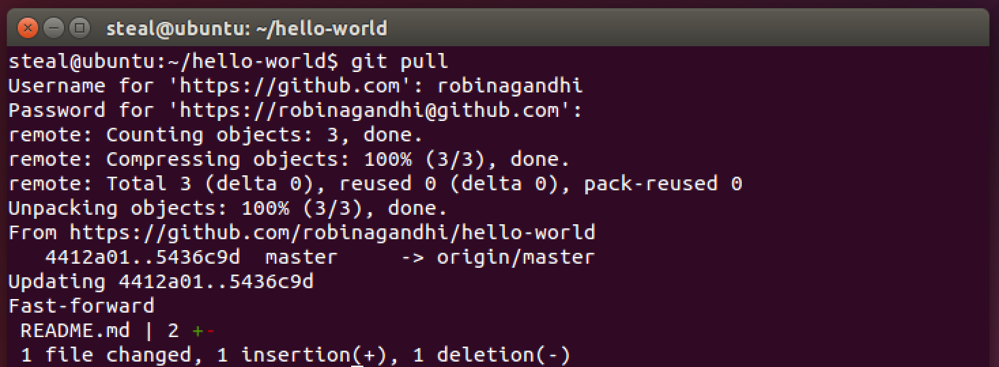

Now if we look at our local README.MD file, it should have the updated link.

1. Locate README.md on your computer
>

2. View README.md contents
>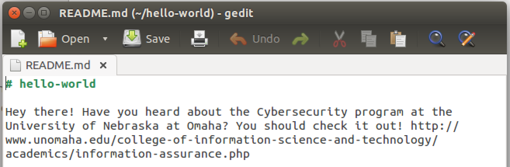

At this point you know enough to keep both the local and remote repositories synchronized.    

As long as you always pull before making changes and keep pushing any new changes - you will avoid most merge conflicts that can occur.  

If you are interested in learning more about complex team interaction scenarios - you may want to explore a concept called merge conflicts; for more information see: [https://help.github.com/articles/resolving-a-merge-conflict-from-the-command-line/](https://help.github.com/articles/resolving-a-merge-conflict-from-the-command-line/).

[Top](#table-of-contents)

### Step 6
Now we will learn about **forking** a repository. This is as easy as pie. But what is a fork and what do you use it for?

Here is what Github [says](https://help.github.com/articles/fork-a-repo/):
> A fork is a copy of a repository. Forking a repository allows you to freely experiment with changes without affecting the original project.

> Most commonly, forks are used to either propose changes to someone else's project or to use someone else's project as a starting point for your own idea.

> Every public repository can be forked

So head-on over to a hello-world repository developed by one of your peers. You can do this by browsing to the git URL of their hello-world repository in your browser.  

You should see something like this on your peer's repository:
>

Click the "Fork" button.

After forking, you will have your own copy of your peer's repository to work on. Using [Step 3](#step-3) you can clone this repository to your local computer. Make changes to files and push it back to this forked remote repository.   

You may also choose to make direct changes to it on Github itself. Let's do this in the next step.

[Top](#table-of-contents)

### Step 7
In this step we make changes to the fork of your peers' repository on Github.com and create a pull request.

Let's assume that a `gencyber` (insert your ID here) user forks `robinagandhi/hello-world` repository (this will be your peer's repository).

The forked repository for the `gencyber` user will look like this:
>

The `gencyber` user now makes changes to the README.md file in this forked repository. She is also the owner of this forked repository.
>

Now to suggest these changes to `robinagandhi` user; the `gencyber` user needs to create a `pull` request. So the `gencyber` user switches over to the 'Pull Request' tab on forked repository and clicks the 'new pull request' button. It will look something like this:
>

Here is an open pull request that compares the master branches across the two repositories.
>

The `robinagandhi` user is now notified of a pull request on his hello-world repository.He examines the suggested changes, and in this case the files can be automatically merged.
>

In cases where files cannot be merged automatically, discussions around the pull request can help to resolve the conflicts manually. In this case that won't be necessary. With a few more simple clicks the changes are merged. Your peer will see something like this to confirm the merge:
>

Here is a confirmation message after a successful merge:
>

The updated content is now reflected in the peer's repository. It will be something like this:
>

Now return the favor to your peer. Help them fork your hello-world repository and make a pull request to you.

And that is one way you can collaborate using Github.

[Top](#table-of-contents)

### Step 8
To communicate and write on Github, it is useful to learn `Markdown` and its `Github Flavor Variants`. You may explore this simple format here: https://help.github.com/categories/writing-on-github/


You are now ready to explore the wonderful world of open source on Github. Enjoy and make your own contributions!

[Top](#table-of-contents)

### Cyber security First Principle Reflections

On Github, only the `owner` of a remote repository can push commits to it. All other `Github users` have the limited privilege to make a pull request. The repository owner reviews pull requests and initiates a merge action. The owner may reject pull requests if the do not seen appropriate. A `collaborator` can push commits, but cannot delete a repository or add other collaborators. These constraints show the concept of _least privilege_ with github user roles. Users should have no more privilege than what is required for their job.

Developers often design Github repositories, to be self contained _modules_. These modules are then put in or taken out of a bigger project. During build time these components are composed to create an integrated system. This strategy facilitates __Modularization__. Following this principle allows globally distributed teams to collaborate and locate faulty components.

Finally, Github repositories separate source code from other resources. This separation allows longterm archival and maintenance of a codebase, separate from its dependencies. _Domain Separation_ enables the management of source code versions that target different products and operating environments.

[Top](#table-of-contents)

## Additional Resources

* Creating a local repository first and then adding a remote repository, [Github](https://try.github.io/)
* [Github cheatsheet](https://services.github.com/kit/downloads/github-git-cheat-sheet.pdf)
* Collection of [Github tutorials](https://help.github.com/articles/good-resources-for-learning-git-and-github/)
* Ignore files during a check in to Github. https://help.github.com/articles/ignoring-files/

[Top](#table-of-contents)

## Special Thanks

* A special thanks to Matt Hale, Aaron Vigal and Cade Wollcot for reviews of this module and thoughtful discussions.

[Top](#table-of-contents)

#### License
<a rel="license" href="http://creativecommons.org/licenses/by-nc-sa/4.0/"></a><br /><span xmlns:dct="http://purl.org/dc/terms/" property="dct:title">Cybersecurity Modules</span> by <a xmlns:cc="http://creativecommons.org/ns#" href="http://faculty.ist.unomaha.edu/rgandhi/" property="cc:attributionName" rel="cc:attributionURL">Robin Gandhi</a> is licensed under a <a rel="license" href="http://creativecommons.org/licenses/by-nc-sa/4.0/">Creative Commons Attribution-NonCommercial-ShareAlike 4.0 International License</a>.

### Modifications
This module has been modified slightly for the Secure Web Development course by Matt Hale.