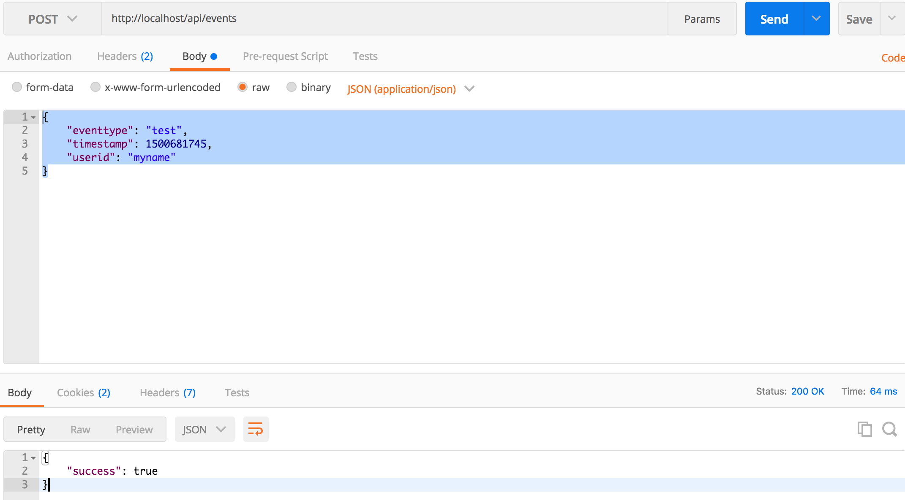
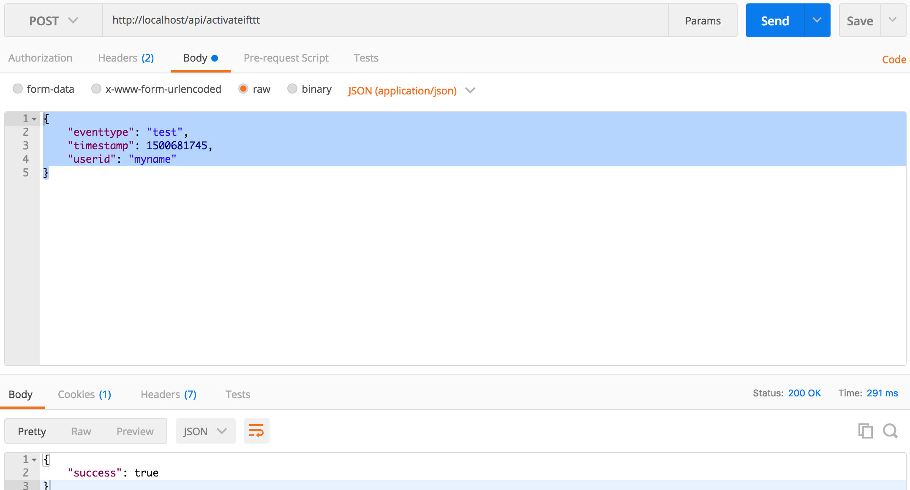
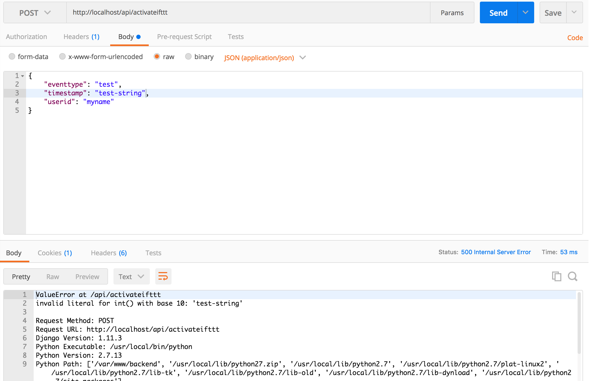
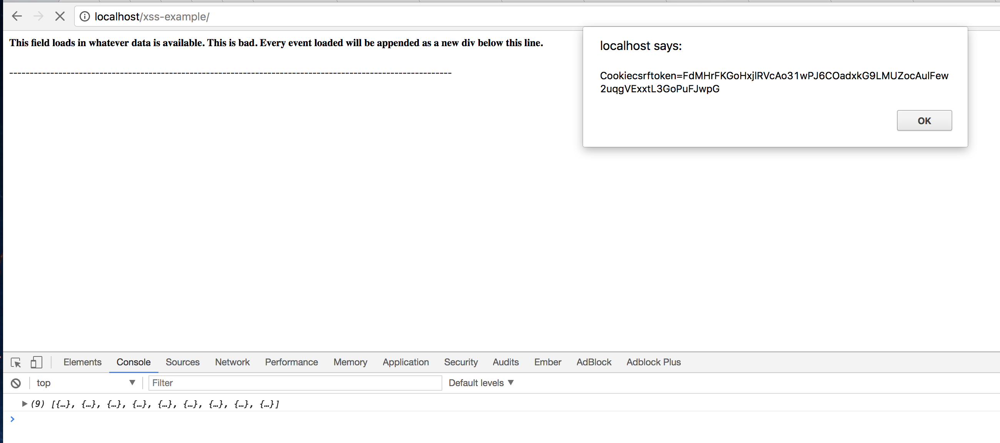
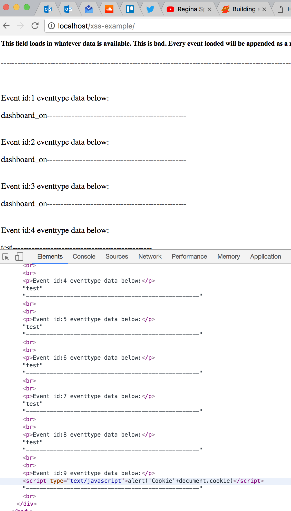
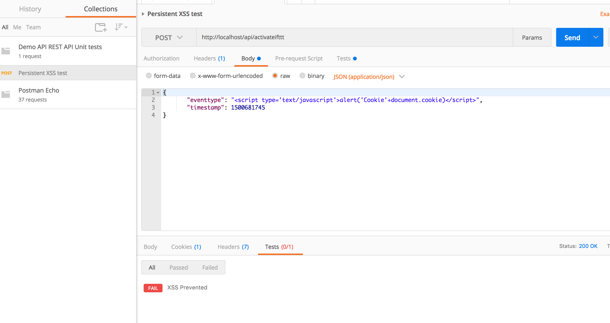

# Penetration Testing

### Introduction
In this module, you will probe the server you created before to see how insecure API endpoints can be.

### Goals
By the end of this tutorial, you will be able to:
* Use a REST Client to make malicious `POST` and `GET` requests to an `API`
* Identify and understand basic `software testing` paradigms
* Identify `software weaknesses` in API endpoints
* Trace exploit `weaknesses` to identify `vulnerabilities`
* Conduct a `risk assessment`


### Materials Required
For this lesson, you will need:

* PC
* Internet connection
* Little bits cloud bit and API Key
* Little bits sensor and actuator

### Prerequisite lessons
You should complete the following lessones before proceeding with this one.
* [Web Services and REST](../restful-api/README.md)
* [Containers](../containers/README.md)
* [Building a server](../building-a-server/README.md)


### Table of Contents
<!-- TOC START min:1 max:3 link:true update:true -->
- [Penetration Testing](#penetration-testing)
    - [Introduction](#introduction)
    - [Goals](#goals)
    - [Materials Required](#materials-required)
    - [Prerequisite lessons](#prerequisite-lessons)
    - [Table of Contents](#table-of-contents)
    - [Step 1: Where we left off](#step-1-where-we-left-off)
    - [Step 2: Key Penetration Testing Concepts](#step-2-key-penetration-testing-concepts)
    - [Step 3: Penetration testing process](#step-3-penetration-testing-process)
    - [Step 4: Getting started testing in POSTMAN](#step-4-getting-started-testing-in-postman)
    - [Step 5: Exploring Authentication and permissions](#step-5-exploring-authentication-and-permissions)
    - [Step 6: Examine the attack surface of our app](#step-6-examine-the-attack-surface-of-our-app)
    - [Step 7: Exploring the `home` method](#step-7-exploring-the-home-method)
    - [Step 7: Explore the `ActivateIFTTT` endpoint](#step-7-explore-the-activateifttt-endpoint)
    - [Step 8: Perform a similar analysis on the other endpoints](#step-8-perform-a-similar-analysis-on-the-other-endpoints)
    - [Step 9: Exploring Error Handling Behavior](#step-9-exploring-error-handling-behavior)
    - [Step 10: Risk Assessment - Summarizing your test results](#step-10-risk-assessment---summarizing-your-test-results)
    - [Step 11: We aren't really done](#step-11-we-arent-really-done)
    - [Step 12: Automated tests for our REST API](#step-12-automated-tests-for-our-rest-api)
    - [Step 13: Mitigating vulnerabilities](#step-13-mitigating-vulnerabilities)
    - [Additional Resources](#additional-resources)
    - [License](#license)

<!-- TOC END -->


### Step 1: Where we left off
When we left off, you had created an `endpoint` to make the button work to send a message to `IFTTT`. We had to store our API key on the server to make this work. Our endpoint accepted a POST request that was handled by a controller that sent a request to an `IFTTT webhook`, before then saving a new event to our own API.

In this lesson, we will take a look at the security our API, including the implications of this service integration to see how our server isn't well protected against attacks.

### Step 2: Key Penetration Testing Concepts
`Penetration testing` is a special kind of `software testing` that evaluates the `attack surface` of an application for potential `software weaknesses` that if left unaddressed can lead to exploitable `vulnerabilities`. At the end of a penetration test, testers have more information about their product and more `assurance` that it will operate correctly in the real world. This section overviews the basics of testing.

At its core, penetration testing, is about trying to **make an app do something it wasn't designed for** and **discover oversights or problems in the implementation and design**.

First of all, what is this?


 > Image credit: Bruegge and Dutoit, _Object-oriented Software Engineering: Using UML, Patterns, and Java_, Prentice Hall, 2010

* It all depends on what the goal of the app is. Maybe this is _how it is supposed to work_ - but probably not.

* `Errors` are when things are about to go wrong. The system enters an `error state`
* `Faults` are the root causes of `errors`
* `Failures` occur after errors and can potentially bring down or harm other systems leading to more errors and failures.


 > Image credit: Bruegge and Dutoit, _Object-oriented Software Engineering: Using UML, Patterns, and Java_, Prentice Hall, 2010

#### Reasons for Errors
There can be many different scenarios that lead to errors.
* Maybe the design is bad.
* Maybe something went wrong with the implementation (an `algorithm fault`)
* Maybe something occurs in the deployment environment that changes the setup and causes a `mechanical fault`


> Image credit: Katerina Kamprani (Wired), https://www.wired.com/2014/04/perfect-terrible-redesigns/


> Image credit: Bruegge and Dutoit, _Object-oriented Software Engineering: Using UML, Patterns, and Java_, Prentice Hall, 2010


 > Image credit: Bruegge and Dutoit, _Object-oriented Software Engineering: Using UML, Patterns, and Java_, Prentice Hall, 2010

#### What can we do about errors and faults?
We can **Test!** The goal of testing is to discover `faults` before they lead to `errors`. Once we know what is wrong, we can `mitigate` it in some way to prevent it from becoming an issue.

* Testing often means traversing the different ways in which your app operates.
* This is especially true for `penetration` tests which identify `security faults` (commonly known as `software weaknesses`) that lead to `security vulnerabilities`.


> Image credit: Bruegge and Dutoit, _Object-oriented Software Engineering: Using UML, Patterns, and Java_, Prentice Hall, 2010

* Once we know, from testing, that `faults` exist, we can `patch` our code to remove it and prevent errors.


> Image credit: Bruegge and Dutoit, _Object-oriented Software Engineering: Using UML, Patterns, and Java_, Prentice Hall, 2010

* Another option is to design our app from the beginning to handle faults better by design. This is a concept called `redundancy`. Redundancy is vitally important for high-criticality systems like those that are operated by NASA, The Department of Defense, and others. `Redundancy` helps, in combination with patching, to ensure that if `errors` do occur they don't cause `failures` before they can be patched.


> Image credit: Bruegge and Dutoit, _Object-oriented Software Engineering: Using UML, Patterns, and Java_, Prentice Hall, 2010

* You can also embrace the chaos. It usually doesn't go well...


> Image credit: Bruegge and Dutoit, _Object-oriented Software Engineering: Using UML, Patterns, and Java_, Prentice Hall, 2010

* Author note: I love these images from Bruegge and Dutoit!

### Step 3: Penetration testing process
Ok, so we understand the basics of testing. How do developers think about penetration testing?

Often `use cases` and `user stories` are used to define what a system should be doing.

* For our app, some user stories might be:
1. As a **home automation enthusiast**, I want to **control my lights from my phone using IFTTT**, so that _I don't have to get off the couch to turn them on or off_.
1. As a **home automation enthusiast**, I want to **view previous home device events**, so that _I know when my devices were used_.

Once you know what the app _should_ do, you can define `misuse cases` or `misuser stories` that describe how bad actors might abuse or impair the use cases and user stories. These `misuse` scenarios guide the kind of penetration testing you might do.

Anytime your app is on the internet you end up having a basic set of `misuse cases` that revolve around the exploitation of web resources for nefarious purposes.

A short list of misuse cases includes:
* Data theft
* User data exfiltration
* Hostile server takeover

These goals, which can be written like `user stories` often involve some form of `web-based-attack`. We are going to look at our server, created in the previous [lesson](../building-a-server/README.md) to see where it may have `weaknesses` that leave it vulnerable to attack.

In general, you can follow this flow chart for thinking about penetration testing (and testing in general):


* A `test case` is just a series of steps to see if the test fails or succeeds
* A `mitigation` is a process to correct the `faults` identified during testing.

#### Test Coverage
In practice, when you are evaluating real-world apps, you want to have strong `coverage` across the app's `attack surface` to ensure you don't miss something by being too focused in one particular area.

I like to think of tests graphically:


* In this example, most of the tests that have been conducted are located on part of the app that (as it turns out) doesn't have many vulnerabilities. These tests identify one `weakness` (upper right) that leads to a `vulnerability` but miss a highly vulnerable area of the app (lower left).
* Maybe this vulnerable area is a `component` that is outdated or not well designed.

Unfortunately, the surface is not the only place where vulnerabilities can occur.


* `Attack vectors` (i.e. pathways that exploit `weaknesses` to produce `vulnerabilities`) can sometimes use identified vulnerabilities to get access to other areas in your app. Those internal components might be less `hardened` against attack.
* Takeaway: It is important to test **all** of your components and surfaces.

### Step 4: Getting started testing in POSTMAN
We've created this pretty cool API and nice client-side interface to use it. However, as you will see, our API is, by default, pretty insecure! In the next sections, we will see just how bad it is by using some penetration tests to identify and highlight problems.

* We will look at them one at a time. First lets start our server. Change into your `webservice lab` folder (i.e. the one you used for the previous lab).
* type `docker-compose up` to run the server

> Note: This assumes your work is completed from the previous lesson.

* Now open `POSTMAN` and send a simple `GET` request to your local server at `https://localhost`.
* What do you get?
* Now try sending a `GET` request to `https://localhost/api/events`
* What do you see?

### Step 5: Exploring Authentication and permissions
The first issue on our server is that it doesn't enforce `authentication`. This violates the __least privilege__ first principle because anonymous users should only be able to login, not see or interact with data.

* Lets go back to our browser and go to http://localhost.
* If you are logged in, click `logout`

<!--  -->
> Note your data items probably look slightly different than mine, since I am developing this lesson and haven't loaded much data in the app!

* click `home` after logging out
* What do you see?

<!--  -->
> Note your data items probably look slightly different than mine, since I am developing this lesson and haven't loaded much data in the app!

What gives? Our data is still visible when we are logged out.
This is because our server is not enforcing authentication on its `API endpoints`.

That means that anyone can get this data?
> Yeah pretty much.

Lets confirm this from `POSTMAN`:

* open your `POSTMAN` window
* Make a `GET` request to `https://localhost/api/events`


> Note your data items probably look slightly different than mine, since I am developing this lesson and haven't loaded much data in the app!

* Notice that we have no headers in the request and we are not sending username/password or any kind of key as part of the request. It just works!
* This means that we can get all of the device event data on the server without even logging in!

### Step 6: Examine the attack surface of our app
Our web server exposes several endpoints for end-user consumption, look at the files `django_backend/urls.py` and `/api/urls.py` in our `nebraska-gencyber-dev-env` folder. From these we see that the urls accepted by our server are:

* `/admin/<approved admin urls>` -> Django admin package
* `/api-auth/<approved rest_framework urls>` -> Rest api-auth package
* `/api/session` -> controllers.Session (Class)
* `/api/register` -> controllers.Register (Class)
* `/api/events` -> controllers.Events (Class)
* `/api/activateIFTTT` -> controllers.ActivateIFTTT (Class)
* `xss-example/` -> controllers.xss_example (method that demonstrates cross-site scripting),
* `/*` -> controllers.home (Single Method that serves up our frontend client)

For our purposes, we will assume that the open source, highly reviewed, and security tested code from the `Django Admin` Package and the `Django REST Framework` library have been sufficiently assessed.

> NOTE: In practice, you want to be careful about making too many assumptions about the security of third party libraries.

That means we need to assess the security of each of the other endpoints.

### Step 7: Exploring the `home` method
Starting from the bottom up, the first method of interest is the home method in `controllers.py`.

This method simply returns an `index.html` file.

```python
def home(request):
   """
   Send requests to / to the ember.js clientside app
   """
   return render_to_response('ember/index.html',
               {}, RequestContext(request))
```

Where does `index.html` come from? We can answer that question by looking in the `django_backend/settings.py` file:

You will see:

```python
TEMPLATES = [
    {
        'BACKEND': 'django.template.backends.django.DjangoTemplates',
        'DIRS': [os.path.join(BASE_DIR, "static/ember/")],
        'APP_DIRS': True,
        'OPTIONS': {
            'context_processors': [
                'django.template.context_processors.debug',
                'django.template.context_processors.request',
                'django.contrib.auth.context_processors.auth',
                'django.contrib.messages.context_processors.messages',
            ],
        },
    },
]
```
This configuration setting joins the operating system's `BASE_DIR` (or base directory) to the `static/ember/` directory. This means, it looks for `/<path-where-django-exists>/static/ember/`. For us that is `../backend/static/ember/`. If we look in that folder we will see the index.html file that loads in the javascript and other files associated with the client you have been looking at all of this time when you visit https://localhost

> In practice you would need to do a full assessment of the client. For now, we will assume it is 'safe' from the point of view of the server.

Overall, our server should assume that clients can be compromised and, therefore, focus on securing any `backend` functionality. This follows a `defense in depth` approach.

What Cybersecurity First Principle might that be?

### Step 7: Explore the `ActivateIFTTT` endpoint
Next up is the `ActivateIFTTT` class. We created this controller in the [previous lesson](../building-a-server/README.md). Since this endpoint includes a `POST` request handler, we should carefully review and assess it.

#### First Question
The first question is does it `require authentication`? Authentication should be used anytime you want to restrict access to data as part of an effort of __information hiding__.

Should `ActivateIFTTT` require authentication, what about the `event` controller?

Keep track of your answers.

#### Second Question
Since it accepts data as part of the `POST` request, the second question is related to how it checks the data submitted in the request. It is **important to check any data** submitted to a server to ensure that it conforms to accepted `types`. This is called `type checking` and is referred to in the web world as `parameterization` or `parameterized requests`.

What data does our method accept?
Does it `type check` the data?
Is our method an example of a `parameterized request`?

#### Third Question
Sometimes you want to restrict access to data based on who is making the request (and sometimes why they are making it). This is the principle of __least privilege__ - that is, only give access to people that need it when they need it. When looking at specific data `objects` a question to ask in the risk assessment process is whether or not `object-level permissions` are used to check access.

In our case, the question is 'does our method restrict who can make the `POST` request?' Assuming authentication was put in place, who has access?

#### Answering Question 1 (Authentication)
Lets evaluate authentication. This one is easy. Looking at the code we see the line: `permission_classes = (AllowAny,)` in the `ActivateIFTTT` class. This, as the name implies, literally allows anyone to access this method. We can confirm this in `POSTMAN`.

* Logout of the application
* Open `POSTMAN`
* Issue the following `POST` request to http://localhost/api/events

Headers:
```json
{
  "Content-Type": "application/json"
}
```

Body:
```json
{
    "eventtype": "test",
    "timestamp": 1500681745,
    "userid": "myname"
}
```


We were able to create a new event without logging in! What about the `ActivateIFTTT` endpoint?

* Issue the same request to http://localhost/api/activateifttt



It works too! So clearly, **authentication is not required here**. It should be - since without authentication **ANYONE** could turn on **OUR** `IFTTT` account or create events for our devices!

#### Answering Question 2 (Parameterization)
The next question was whether or not the request is `parameterized`. Looking at our `post` method for `Events` we see that it only accepts two input fields from the requestor. Everything else is collected elsewhere:

```python
eventtype = request.data.get('eventtype')
timestamp = int(request.data.get('timestamp'))
userid = request.data.get('userid')
```

Looking the the `post` method in `ActivateIFTTT` we see it only accepts two parameters.

```python
eventtype = request.data.get('eventtype')
timestamp = int(request.data.get('timestamp'))
```

We also see that overall, both methods uses the `Event` `model` schema to create a new event.

```python
newEvent = Event(
    eventtype=eventtype,
    timestamp=datetime.datetime.fromtimestamp(timestamp/1000, pytz.utc),
    userid=userid,
    requestor=requestor
)
```

The `Event` model is parameterized by definition - i.e. each of the fields are typed in the definition of the model:

```python
class Event(models.Model):
    eventtype = models.CharField(max_length=1000, blank=False)
    timestamp = models.DateTimeField()
    userid = models.CharField(max_length=1000, blank=True)
    requestor = models.GenericIPAddressField(blank=False)

    def __str__(self):
        return str(self.eventtype)
```

The only fields of concern here are `eventtype` and `userid`. We need to ensure that these fields are actually strings. Since **accepting arbitrary string data is bad**, it is also a good idea to not allow any raw special characters or symbols that can be used for nefarious purposes (like the keyword `javascript` or parentheses and slashes). For these characters, you want to either remove them or `escape` them.

Let's test our fields.

* Send a request with string data in the `timestamp` field



What happened? Oops, we caused the server to generate a 500 error. This happened because it tried to turn an arbitrary string into an `DateTimeField`. It is good that it didn't accept it, but it is bad that it crashed! Look at that error message it gave us!

* lets change the `timestamp` back and try to send a `cross-site scripting attack` using the event field.
* Issue a `POST` request to http://localhost/api/activateifttt with the following body:

```json
{
       "eventtype": "<script type='text/javascript'>alert('Cookie'+document.cookie)</script>",
       "timestamp": 1500681745
}
```


* It worked! We can send any string text to our app!
* The good news is that `Django` automatically `escapes` the string before storing it in the database.
* The other good news is that our client also `escaped` the string before inserting it into the page.
* The bad news is that if a client rendered that string as `HTML` bad stuff would happen.

To show you how bad storing arbitrary string text can be, the skeleton code in the original lab includes an endpoint we have ignored up to this point called `xss_example`. This stands for _cross-site scripting example_. The code for the example is loaded in a stand-alone index.html file in the `/backend/static/dumb-test-app` folder. Specifically, this **dumb** client includes the following (fairly typical) javascript method that is often used for loading data.


```html
<html>
  <head>
    <script src="http://code.jquery.com/jquery.js"></script>
    <script type="text/javascript">
      $.get('../api/events').then(function(events){
        console.log(events)
        events.forEach(function(event){
          $('#this-is-bad').append("<br>");
          $('#this-is-bad').append('<p>Event id:' + event.pk + ' eventtype data below:' +'</p>');
          $('#this-is-bad').append(event.fields.eventtype)
          $('#this-is-bad').append("---------------------------------------------------<br>");

        });
      });

    </script>
  </head>
  <body>
    <div id='this-is-bad'>
      <h5>This field loads in whatever data is available. This is bad. Every event loaded will be appended as a new div below this line.</h5>
      <p>------------------------------------------------------------------------------------------------------------</p>
    </div>
  </body>
```

* In this html file we see that it includes `jquery` and then uses the `$.get` ajax method to make a `GET Request` to the server api, get the deviceevent data, and then use the `append` method to load it into the page.
* While this type of data loading is **quite typical** in many web applications it is **highly vulnerable** to a type of `cross-site scripting (XSS)` attack called `stored cross-site scripting`.
* In our case, our server `API endpoint` did not filter the string text, so it allows for XSS text to be stored as a string. When the client loads the data from the server, it `renders it as HTML` causing the XSS attack to succeed and a popup to be generated.

If you visit, https://localhost/xss_example/ you can see this `Stored XSS` attack in action.




#### Answering Question 3 (Object Level Permissions)
In this case, our method doesn't use authentication, so it **doesn't** use `object-level permissions` by default. If we did add authentication and wanted to check for object-level permissions. We would need to check that the code checks not just if the user is authenticated but also if they have permissions on that object to do what they are asking to do.

We may come back to this .

### Step 8: Perform a similar analysis on the other endpoints
Look at the other URLs our app makes use of. Ask yourself similar questions and back them up with some tests. Keep track of the results you find as you go along.

### Step 9: Exploring Error Handling Behavior
Earlier, in Step 7 we saw that sending a string in the `timestamp` field generated the following error message:


The problem here is not just that the field is mishandled, but that the error gives **FULL DETAILS ABOUT THE SERVER CONFIG**. As you can imagine listing out all the server details is bad practice.

Accidentally revealing server information is a big problem. While this info is really helpful during development, it can expose the server if users see it in production. You can turn off debug information by setting a `DEBUG = False` in the `/django_backend/settings.py` file.


### Step 10: Risk Assessment - Summarizing your test results
For now, lets summarize the `test results` that we have collected to identify what our risks look like. Usually, risks are collected and then ranked according to `severity` (or `impact`) and `likelihood` (i.e. how probable an attack is to occur). In organizations or systems with many risks, preventing all of them isn't always feasible. `Risk prioritization` can help you decide which threats to focus on first and which vulnerabilities need to be mitigated most.


Based on the risks you've identified, score them and rank them based what you think the `likelihood` and `impact` of exploitation might be. While our list is small (and we can mitigate all of the problems) - this tool is useful when you have limited time, money, and other resources.

### Step 11: We aren't really done
Tests are not meant to be once and done. As we talked about in the `Test Driven Development` discussion, you should think of tests as a driver for writing software. You should also run them almost every time you make a change to your code. This is why we need a `unit testing` framework to really rigrously and continuously test our code. For the purposes of this lesson, we will focus on blackbox unit tests that only test `REST endpoints`. We can use `POSTMAN` - which is actually even more amazing than we've seen so far.

`POSTMAN` uses a concept called `Collections` that allow you to group and run many requests with a single button. Collections also allow you to easily create blackbox tests for your rest endpoints.

It turns out that there is a great tutorial on `POSTMAN` collections. Lets explore that first and then return here.

* Visit [http://blog.getpostman.com/2014/03/07/writing-automated-tests-for-apis-using-postman/](http://blog.getpostman.com/2014/03/07/writing-automated-tests-for-apis-using-postman/) and follow along with part 1 and part 2 of the tutorial. Then return here.

### Step 12: Automated tests for our REST API
Lets create some `unit tests` for our `REST API` using `POSTMAN` collections.

* Start by creating a new collection. Call it `Demo REST API Unit tests`
* Using the `POST` request to http://localhost/api/activateifttt click `tests`, and then add the following:

```javascript
var jsonData = JSON.parse(responseBody);
tests["XSS Prevented"] = jsonData.success === false;
```
* Save the request to the collection using the name `Persistent XSS test`
* This small piece of javascript creates a new test in the array of `tests` called 'XSS Prevented'. This test passes if the `success` field is false in the response.
* If we click our `tests` tab in the response, we should see it currently failing



Lets create a test to check authentication (question 1).

* Create a new `GET` request to http://localhost/api/session
* click the `tests` tab and add the following script to save the response `isauthenticated` result as a global variable for later use in other tests.

```javascript
var jsonData = JSON.parse(responseBody);
postman.setGlobalVariable("isauthenticated", jsonData.isauthenticated);
```
* Now save the request using the name `Auth check`
* Now create a new `POST` request to http://localhost/api/events with the following:

Headers:
```json
{
  "Content-Type": "application/json"
}
```

Body:
```json
{
    "eventtype": "unit-test-events",
    "timestamp": 1500681745,
    "userid": "myname"
}
```

Tests tab:
```javascript
var jsonData = JSON.parse(responseBody);
tests["Event Endpoint Authentication Check"] =  (jsonData.success === true) && JSON.parse(globals.isauthenticated);
```
* This check ensures that if success is returned by the server, globals.isauthenticated is also true. Since the request is in the same collection, the check auth request will ensure that `isauthenticated` is correctly populated.
* Make some other unit tests for your `API endpoints`. In practice, you would want a test for every endpoint.

### Step 13: Mitigating vulnerabilities
Lets fix some of our vulnerabilities. For our XSS script, we might either 1) whitelist only certain characters (such as letters and numbers) for our event name and userid fields or 2) escape the characters in either a `javascript` or `html` format.

Look to the [OWASP cheat sheet](https://www.owasp.org/index.php/Input_Validation_Cheat_Sheet) for more information on input validation. [Python Bleach](https://pypi.python.org/pypi/bleach) is a great library for doing sanitization.

Try to sanitize and validate some of the fields to make the tests pass by rejecting requests that contain unacceptable characters.

### Additional Resources
For more information, investigate the following.

* [Bruegge and Dutoit, _Object-oriented Software Engineering: Using UML, Patterns, and Java_, Prentice Hall, 2010](http://dl.acm.org/citation.cfm?id=1795808)


### License
Lesson content: Copyright (C) [Dr. Matthew Hale](http://faculty.ist.unomaha.edu/mhale/) 2017 or as listed.  
<a rel="license" href="http://creativecommons.org/licenses/by-nc-sa/4.0/"></a><br /><span xmlns:dct="http://purl.org/dc/terms/" property="dct:title">This lesson</span> is licensed by the author under a <a rel="license" href="http://creativecommons.org/licenses/by-nc-sa/4.0/">Creative Commons Attribution-NonCommercial-ShareAlike 4.0 International License</a>.
