# RESTFul APIs and Twitter 

### Cybersecurity First Principles in this lesson

* __Abstraction__: An abstraction is a representation of an object or concept. It could be something such as a door, a speedometer, or a data structure in computer science. Abstraction decouples the design from the implementation. The gauges in an automobile are an abstraction of the performance of a car. A map is an abstraction of the earth.

* __Data Hiding__: Data hiding is the technique that does not allow certain aspects of an object to be observed or accessed. Data and information hiding keeps the programmer from having complete access to data structures. It allows access to only what is necessary.

* __Layering__: Cyber security uses multiple layers of defense or protecting information. If one layer is defeated the next layer should catch it.

* __Least Privilege__: One of the ways to protect information is by limiting what people can see and do with your information and resources. The principle of least privilege says to allow the minimum number of privileges necessary to accomplish the task.

* __Minimization__: Minimization refers to having the least functionality necessary in a program or device. The goal of minimization is to simplify and decrease the number of ways that software can be exploited. This can include **turning off ports that are not needed**, reducing the amount of code running on a machine, and/or turning off unneeded features in an application.

* __Modularization__: The concept of modularity is like building blocks. Each block (or module) can be put in or taken out from a bigger project. Each module has its own separate function that is interchangeable with other modules.

* __Resource Encapsulation__: Encapsulation is an object oriented concept where all data and functions required to use the resource are packaged into a single self-contained component. The goal is to only allow access or manipulation of the resource in the way the designer intended. An example, assume a flag pole is the object. There are fixed methods on how the flag pole is to be used. Put the flag on, take the flag off, raise or lower the flag. Nothing else can be done to the flag pole.

* __Simplicity__: Simplicity allows a person to better understand hardware and software. Without the clutter of unnecessarily complicated code and interfaces, the software will be more understandable by people that will update the code when requirements change. It will be easier to understand by the testers and they will be able to spot problems sooner. By keeping software as simple and as focused as possible, the reliability and security is greatly increased.

### Introduction
In this module, you will learn what a RESTful API is, how Twitter uses APIs to expose their data to the world, and how you can interact with an API.

### Goals
By the end of this tutorial, you will be able to:
* Define `REST`, `an endpoint`, `API Integration`, and `API Invocation`
* Use a REST Client to make `POST` and `GET` requests to an `API`
* Using manual requests to `mashup` web services


### Materials Required
For this lesson, you will need:

* PC
* Internet connection
* A twitter account
* Google Chrome
* [The POSTMAN Chrome App](https://chrome.google.com/webstore/detail/postman/fhbjgbiflinjbdggehcddcbncdddomop?hl=en)

### Prerequisites
None

### Table of Contents
<!-- TOC START min:1 max:3 link:true update:true -->
- [RESTFul APIs and Little bits](#restful-apis-and-little-bits)
    - [Cybersecurity First Principles in this lesson](#cybersecurity-first-principles-in-this-lesson)
    - [Introduction](#introduction)
    - [Goals](#goals)
    - [Materials Required](#materials-required)
    - [Prerequisites](#prerequisites)
    - [Table of Contents](#table-of-contents)
    - [Step 1: Background](#step-1-background)
    - [Step 2: Ok, lets take a look at a real API](#step-2-ok-lets-take-a-look-at-a-real-api)
    - [Step 3: Getting our API Key](#step-3-getting-our-api-key)
    - [Step 4: Making your first REST request](#step-4-making-your-first-rest-request)
    - [Step 5: Other GET Requests](#step-5-other-get-requests)
    - [Step 6: First POST request to create a new tweet](#step-6-first-post-request-to-create-a-new-tweet)
    - [Checkpoint](#checkpoint)
    - [Additional Resources](#additional-resources)
    - [Acknowledgements](#acknowledgements)
    - [License](#license)

<!-- TOC END -->

### Step 1: Background
Before we get started, lets talk about what an `API` is.

> This background text and its associated images are modified for this setting by Matt Hale. Modifications are licensed under creative commons share-alike. The original material it is based upon was created by the Mozilla foundation and its contributors. Credit: https://developer.mozilla.org/en-US/docs/Web/HTTP/Overview#
https://developer.mozilla.org/en-US/docs/Web/HTTP/Messages

**HTTP** is a `protocol` which allows the fetching of resources, such as HTML documents. It is the foundation of any data exchange on the Web and a client-server protocol, which means requests are initiated by the recipient, usually the Web browser. A complete document is reconstructed from the different sub-documents fetched, for instance text, layout description, images, videos, scripts, and more.


Clients and servers communicate by exchanging individual messages (as opposed to a stream of data). The messages sent by the client, usually a Web browser, are called `requests` and the messages sent by the server as an answer are called `responses`.

Designed in the early 1990s, HTTP is an extensible protocol which has evolved over time. It is an application layer protocol that is sent over `TCP`, or over a `TLS`-encrypted TCP connection, though any reliable transport protocol could theoretically be used. Due to its extensibility, it is used to not only fetch hypertext documents, but also images and videos or to post content to servers, like with HTML form results. HTTP can also be used to fetch parts of documents to update Web pages on demand.

#### HTTP Messages

HTTP messages are composed of textual information encoded in ASCII, and span over multiple lines. In HTTP/1.1, and earlier versions of the protocol, these messages were openly sent across the connection. In HTTP/2, the once human-readable message is now divided up into HTTP frames, providing optimization and performance improvements.

Web developers, or webmasters, rarely craft these textual HTTP messages themselves: software, a Web browser, proxy, or Web server, perform this action. They provide HTTP messages through config files (for proxies or servers), APIs (for browsers), or other interfaces.


The HTTP/2 binary framing mechanism has been designed to not require any alteration of the APIs or config files applied: it is broadly transparent to the user.

HTTP requests, and responses, share similar structure and are composed of:

1.  A `start-line` describing the requests to be implemented, or its status of whether successful or a failure. This start-line is always a single line.
2.  An optional set of `HTTP headers` specifying the request, or describing the body included in the message.
3.  A blank line indicating all meta-information for the request have been sent.
4.  An optional `body` containing data associated with the request (like content of an HTML form), or the document associated with a response. The presence of the body and its size is specified by the start-line and HTTP headers.

The start-line and HTTP headers of the HTTP message are collectively known as the `head` of the requests, whereas its payload is known as the `body`.


#### HTTP Requests

##### Start line

`HTTP requests` are messages sent by the client to initiate an action on the server. Their `start-line` contain three elements:

1.  An **HTTP Method**, a verb (like `GET`, `PUT`, `POST`, or `DELETE`) or a noun (like `HEAD` or `OPTIONS`), that describes the action to be performed. For example, `GET` indicates that a resource should be fetched or `POST` means that data is pushed to the server (creating or modifying a resource, or generating a temporary document to send back). `PUT` modifies an existing resource, while `DELETE` removes one.
2.  The **request target**, usually a `URL`, or the absolute path of the protocol, port, and domain are usually characterized by the request context. The format of this request target varies between different HTTP methods. It can be
    *   An absolute path, ultimately followed by a `'?'` and query string. This is the most common form, known as the _origin form_, and is used with `GET`, `POST`, `HEAD`, and `OPTIONS` methods.  
        `POST / HTTP 1.1  
        GET /background.png HTTP/1.0  
        HEAD /test.html?query=alibaba HTTP/1.1  
        OPTIONS /anypage.html HTTP/1.0`
    *   A complete URL, known as the _absolute form_, is mostly used with `GET` when connected to a proxy.  
        `GET http://developer.mozilla.org/en-US/docs/Web/HTTP/Messages HTTP/1.1`
    *   The authority component of a URL, consisting of the domain name and optionally the port (prefixed by a `':'`), is called the _authority form_. It is only used with `CONNECT` when setting up an HTTP tunnel.  
        `CONNECT developer.mozilla.org:80 HTTP/1.1`
    *   The _asterisk form_, a simple asterisk (`'*'`) is used with `OPTIONS`, representing the server as a whole.  
        `OPTIONS * HTTP/1.1`
3.  The **HTTP version** which defines the structure of the remaining message, acting as an indicator of the expected version to use for the response.

#### Headers

`HTTP headers` from a request follow the same basic structure of an HTTP header: a case-insensitive string followed by a colon (`':'`) and a value whose structure depends upon the header. The whole header, including the value, consist of one single line, which can be quite long.

There are numerous request headers available. They can be divided in several groups:

*   **General headers**, like `Via`,  apply to the message as a whole.
*   **Request headers**, like `User-Agent`, `Accept-Type`, modify the request by specifying it further (like `Accept-Language`), by giving context (like `Referer`), or by conditionally restricting it (like `If-None`).
*   **Entity headers**, like `Content-Length` which apply to the body of the request. Obviously there is no such header transmitted if there is no body in the request.


#### Body

The final part of the request is its body. Not all requests have one: requests fetching resources, like `GET`, `HEAD`, DELETE, or OPTIONS, usually don't need one. Some requests send data to the server in order to update it: as often the case with `POST` requests (containing HTML form data).

Bodies can be broadly divided into two categories:

*   **Single-resource bodies**, consisting of one single file, defined by the two headers: `Content-Type` and `Content-Length`.
*   **[Multiple-resource bodies](https://developer.mozilla.org/en-US/docs/Web/HTTP/Basics_of_HTTP/MIME_types#multipartform-data)**, consisting of a `multipart body`, each containing a different bit of information. This is typically associated with `HTML Forms`.

#### HTTP Responses

##### Status line

The start line of an HTTP response, called the `status line`, contains the following information:

1.  The `protocol version`, usually `HTTP/1.1`.
2.  A `status code`, indicating success or failure of the request. Common status codes are `200` (ok), `404` (Not found), or `500` (Server error)
3.  A `status text`. A brief, purely informational, textual description of the status code to help a human understand the HTTP message.

A typical status line looks like: `HTTP/1.1 404 Not Found.`

#### Headers

`HTTP headers` for responses follow the same structure as any other header: a case-insensitive string followed by a colon (`':'`) and a value whose structure depends upon the type of the header. The whole header, including its value, presents as a single line.


#### Body

The last part of a response is the `body`. Not all responses have one: responses with a status code, like `201` or `204`, usually don't.

Bodies can be broadly divided into three categories:

*   **Single-resource bodies**, consisting of a single file of known length, defined by the two headers: `Content-Type` and `Content-Length`.
*   **Single-resource bodies**, consisting of a single file of unknown length, encoded by chunks with `Transfer-Encoding` set to `chunked`.
*   **[Multiple-resource bodies](https://developer.mozilla.org/en-US/docs/Web/HTTP/Basics_of_HTTP/MIME_types#multipartform-data)**, consisting of a multipart body, each containing a different section of information. These are relatively rare.

### Step 2: Ok, lets take a look at a real API
These concepts, i.e. _request_ and _response_, are central to the concept of `RESTful APIs`. REST, or REpresentational State Transfer, APIs, or Application Programming Interfaces, are tools that developers use to provide __abstraction__ and __resource encapsulation__ to people who want to interact with their data.

APIs allow you to get and save data back to an application, without needing to tightly integrate with that application. This improves __simplicity__ and helps your code to be more __modular__. APIs include `endpoints`, such as `/api/events`, that allow you to access certain specific data (e.g. events in this example). API endpoints help provide __minimization__ since users can only interact with the application through those interfaces provided by the developer.

...Enough talk! Lets look at an API!

Open Chrome and go to: [https://dev.twitter.com/rest/tools/console](https://dev.twitter.com/rest/tools/console)

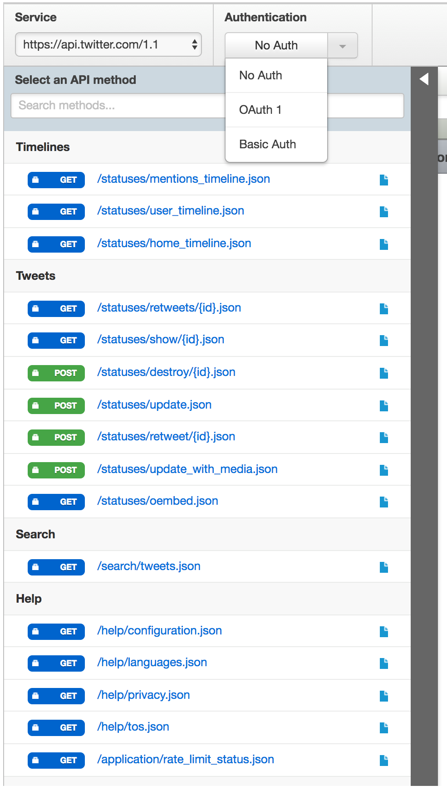

* Select `Oauth 1` (we'll talk about this in a second)
* Grant permission to APIGee using your twitter Login

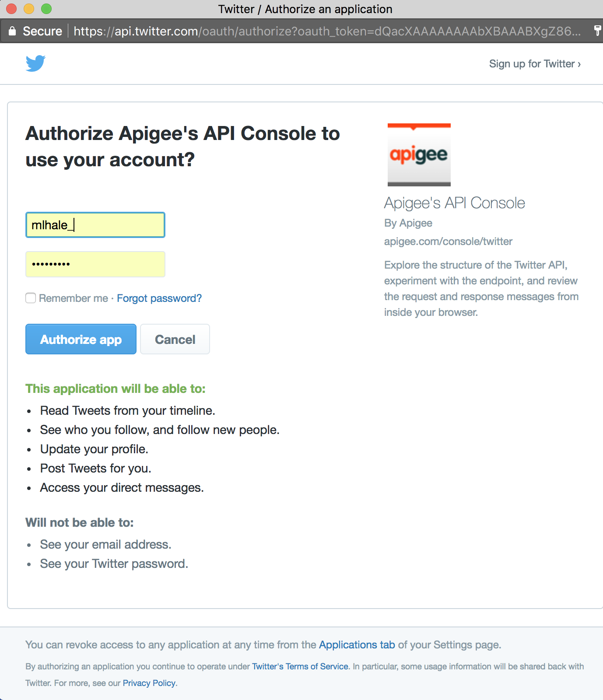

* Once authenticated, select `trends/place`

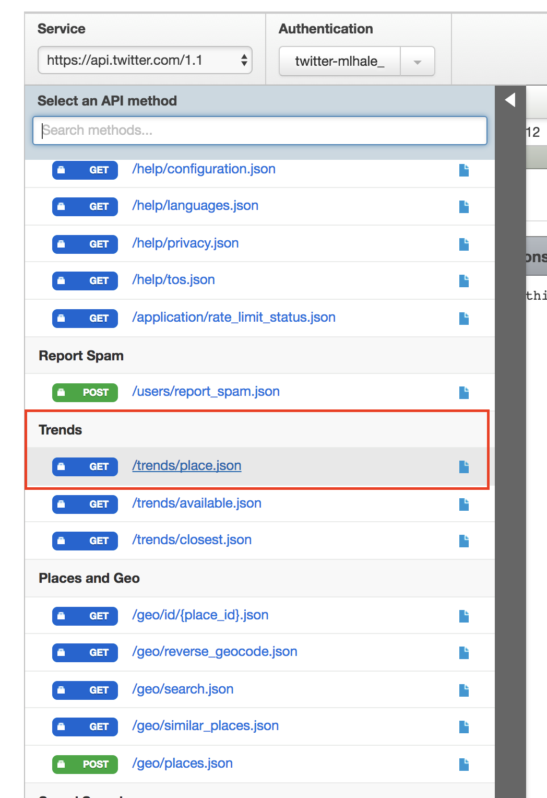

* Click this option, in the `id` field enter `2465512` (the id for omaha)
* Click send to see the results of the query (a list of top recent trending tweets in Omaha.)

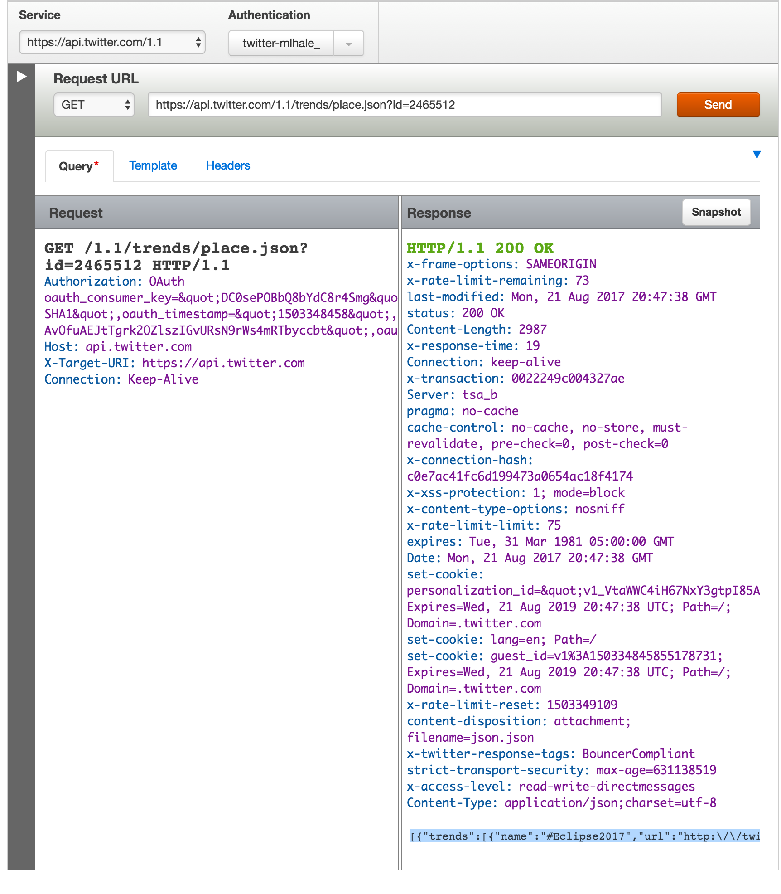

Ok, so the API works.

### Step 3: Getting our API Key
Secure APIs don't just accept requests and provide responses to anyone. APIs use a concept called `least privilege` to allow end-users to only have access to the features they need. Since we own a twitter account, we should have the ability to do anything we want with it, but we might want to prevent other people from abusing and misusing our access.

To ensure that only we can issue commands to our account, Twitter requires a form of authentication called an `API Key`. This key is a really long alphanumerical string that would be hard to crack. There are several types of `API Keys`. Some are single strings that don't change over time. Some are `tokens` that persist for a certain amount of time and can be `revoked` as necessary. Twitter uses the most popular and wide spread authentication framework called `Oauth`. Twitter uses both `Ouath 1.0` and `Oauth 2.0` depending on the type of request you are making. Instead of just using tools like APIGee, we are going to create a new `twitter app` that uses `Oauth 2.0` to authenticate and receive an `API Key` in the form of an `Oauth 2.0 Access Token`.

* Create a new twitter app at [https://apps.twitter.com/app/new](https://apps.twitter.com/app/new) You can call the app whatever you want. I called mine _8470-twitter-app_.

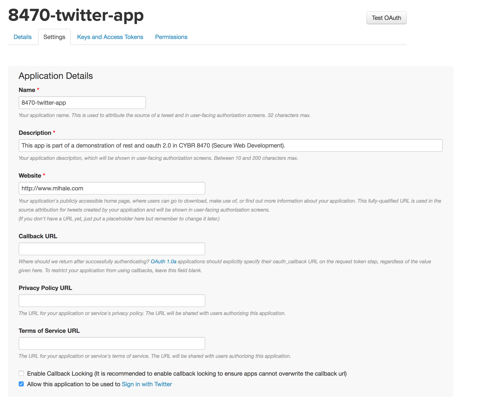

* Click the `Keys and Access Tokens` tab once created.
* Click `Create my access token`
* Don't share this info with anyone, it is your private key.


### Step 4: Making your first REST request
Now that we have our API Key, lets use it to make a request.

POSTMAN is a REST client, that allows end users to make requests to test their APIs. Lets use it to test the `twitter API`. Launch POSTMAN by typing ```chrome://apps``` into the Chrome address bar, hit enter, and then click the POSTMAN icon.


In POSTMAN, lets build a new GET request targeted at the URL we explored before:
https://api.twitter.com/1.1/trends/place.json

* Find and click the `Authorization` button and then click `Get New Access Token`

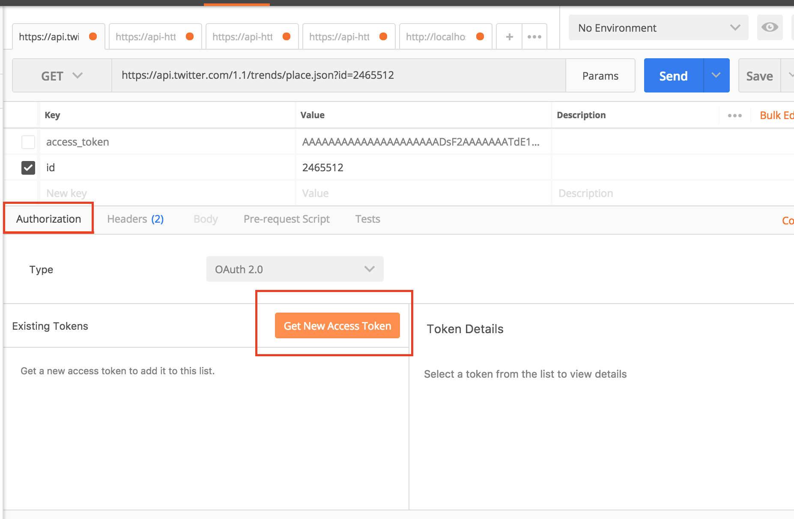

* In the popup, add in your info from the twitter API app page. It should look something like mine:

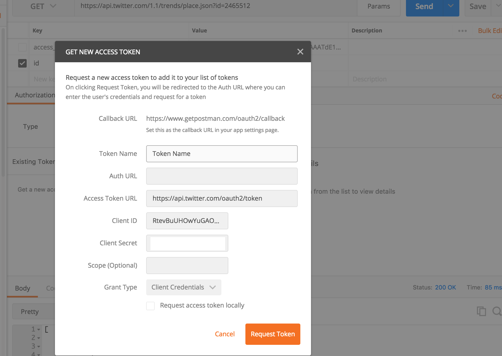

> Note that `clientID` is your `App Consumer Key` and `client secret` is `App Consumer Secret` on twitter

* Hit `Request token` when done. This will ask twitter for an `API Key` that `POSTMAN` can then use to authenticate subsequent requests to the API.

> For reference this is what happens in the background:

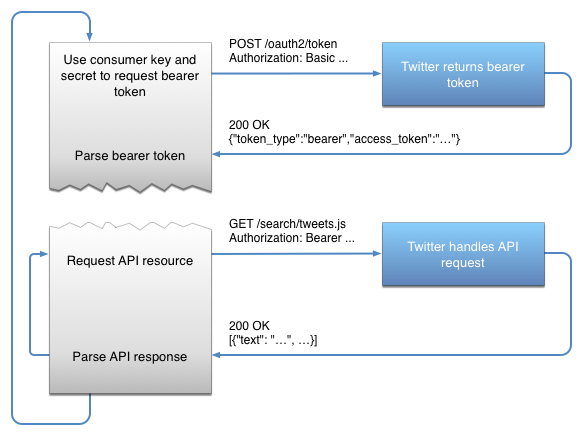

* Now that we have a token, you should see that the token has been added as a parameter called `access_token`. Lets add the `id` for Omaha again.

At this point your request should look something like:

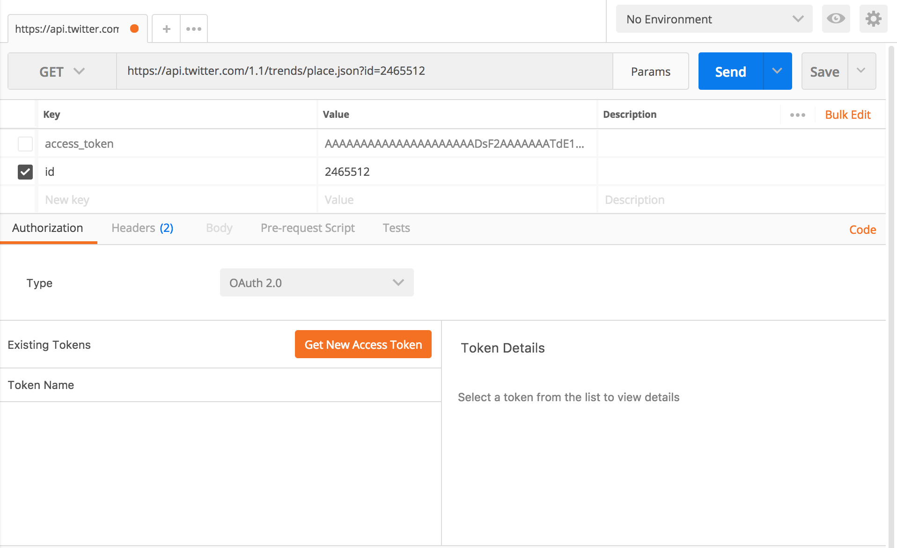

* Hit the ```send``` button to issue the _GET request_ to the URL. You should see recent results. In my case I wrote this during the 2017 eclipse and saw the following as the eclipse went through Omaha.

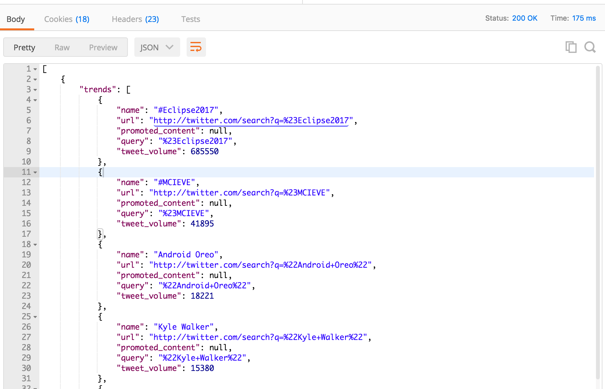

### Step 5: Other GET Requests
Try some other requests using the `search API` on twitter. See: [https://dev.twitter.com/rest/public/search](https://dev.twitter.com/rest/public/search) for more information about the different options.

Your queries should target [https://api.twitter.com/1.1/search/tweets.json](https://api.twitter.com/1.1/search/tweets.json)

### Step 6: First POST request to create a new tweet
Now that we have the basics of `GET requests` to access tweet data, lets try making a new tweet! We will work with the `API endpoint` here: [https://dev.twitter.com/rest/reference/post/statuses/update](https://dev.twitter.com/rest/reference/post/statuses/update)

Configure a request to [https://api.twitter.com/1.1/statuses/update.json](https://api.twitter.com/1.1/statuses/update.json)

* Make sure to add a `user_id` field corresponding to your twitter user id (shown on the APP page as the `owner id`) and a `status` field which will be the 140 character or less message to post to your account. In my case I'm trying to post to my account `mlhale_` (id: `	246485084`) with the status:

```
Testing%20RESTful%20API%20lesson%20for%20%23security%20%23webdev%20class%20%23unomaha
```

Which is a URL encoded (to remove spaces and special characters) of the status:

```
Testing RESTful API lesson for #security #webdev class #unomaha
```

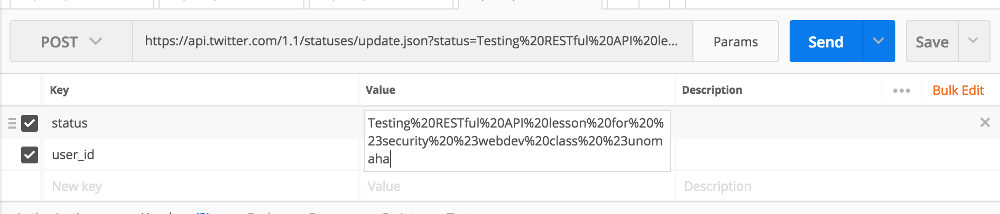

* Hit the ```send``` button to issue the _POST request_ to the URL.
* What happened?

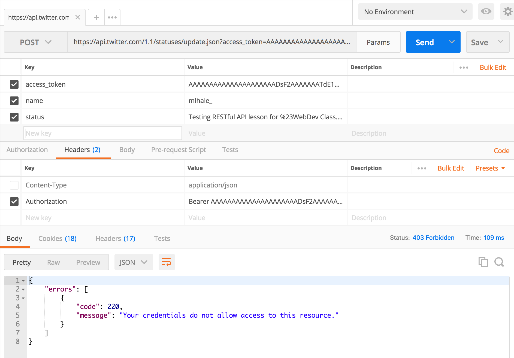

* Twitter restricts the access of `Tokens` to the context that it has access to. Since we are using an `App Key` we do not have access to the user.

Notice that the API Resource reference [here](https://dev.twitter.com/rest/reference/post/statuses/update) marks the required authentication with `user context only`. This means that you need to be logged in using that user's context to successfully `POST` as them.

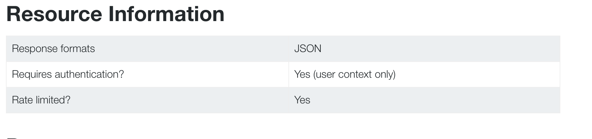

* To do this, we need to switch to `Oauth 1` and provide a user context. Remember that `access token` you generated in Step 3? Now is where it will be useful. Basically, what you did was grant the app you created access to your twitter account. Now we are going to use the token it was given to authorize it to post on your behalf. Usually you would implement a 3 way oauth chain to get this token:

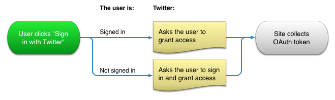

* For now lets use what we have. Visit [https://apps.twitter.com/](https://apps.twitter.com/)
* Click the app you created.
* Now in `POSTMAN` select `Authorization` and then set the type to `Oauth 1`
* Enter your information:

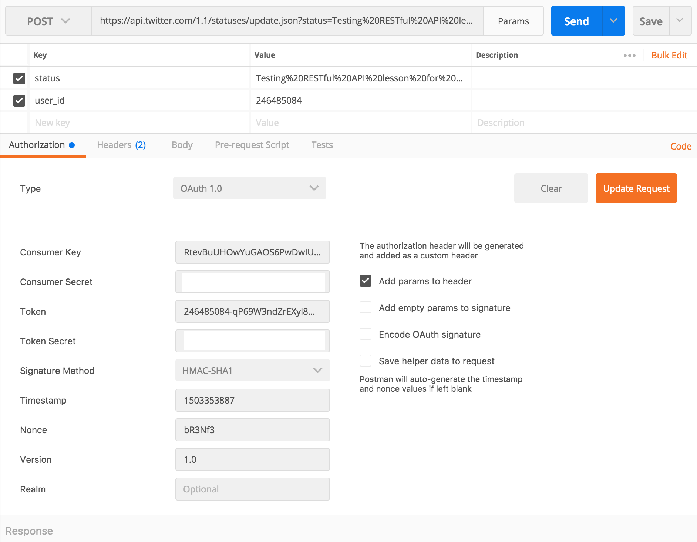

* Click send. You should see a success message now! Check your twitter account:


> It worked!

### Checkpoint
Lets review what we've learned.


### Additional Resources
For more information, investigate the following.

* [https://developer.mozilla.org/en-US/docs/Web/HTTP/Overview](https://developer.mozilla.org/en-US/docs/Web/HTTP/Overview) - Overview of basic HTTP operations
* [https://developer.mozilla.org/en-US/docs/Web/HTTP/Messages](https://developer.mozilla.org/en-US/docs/Web/HTTP/Messages) - Overview of request and response messages in HTTP
* [https://dev.twitter.com/rest/reference/](https://dev.twitter.com/rest/reference/) - Twitter API reference


### License
Based upon [GenCyber Littlebits RESTFul API Lesson](https://github.com/MLHale/nebraska-gencyber/tree/master/teachers/restful-api) Copyright (C) [Dr. Matthew Hale](http://faculty.ist.unomaha.edu/mhale/) 2017.  

Adapted for Twitter: Copyright (C) [Dr. Matthew Hale](http://faculty.ist.unomaha.edu/mhale/) 2017.  
<a rel="license" href="http://creativecommons.org/licenses/by-nc-sa/4.0/"></a><br /><span xmlns:dct="http://purl.org/dc/terms/" property="dct:title">This lesson</span> is licensed by the author under a <a rel="license" href="http://creativecommons.org/licenses/by-nc-sa/4.0/">Creative Commons Attribution-NonCommercial-ShareAlike 4.0 International License</a>.
