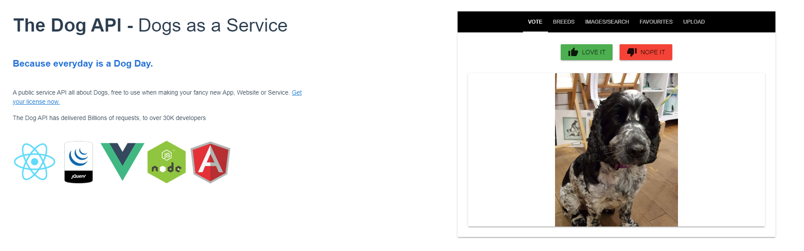
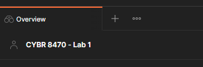
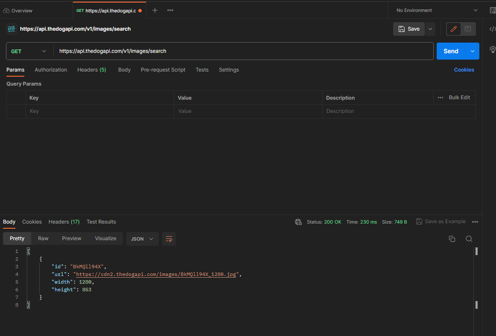
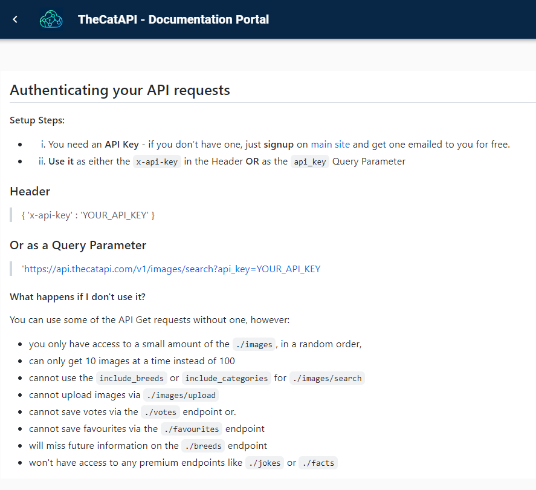
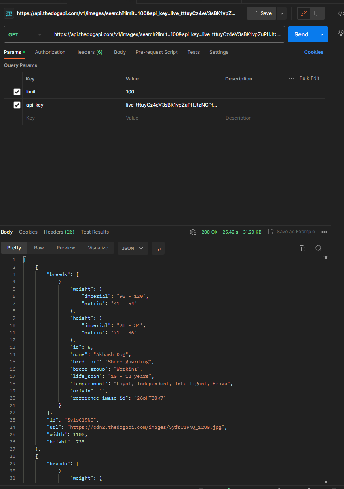
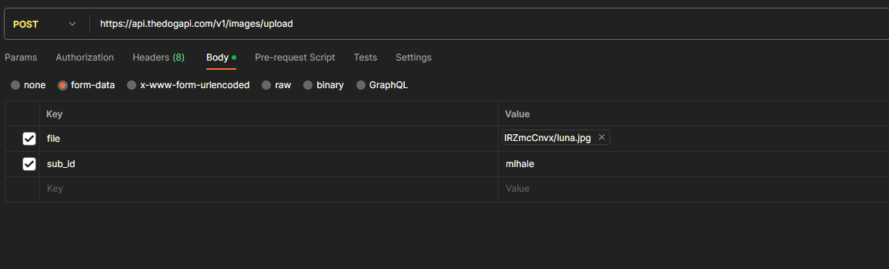

# RESTFul APIs

### Introduction
In this module, you will learn what a RESTful API is, how real APIs to expose their data to the world, and how you can interact with an API.

### Goals
By the end of this tutorial, you will be able to:
* Define `REST`, `an endpoint`, and `API Integration`
* Use a REST Client to make `POST` and `GET` requests to an `API`
* Using manual requests to `mashup` web services


### Materials Required
For this lesson, you will need:

* PC
* Internet connection
* Google Chrome
* [The POSTMAN App](https://www.postman.com/downloads/)

### Prerequisites
None

### Table of Contents
<!-- TOC START min:1 max:3 link:true update:true -->
- [RESTFul APIs](#restful-apis)
    - [Cybersecurity First Principles in this lesson](#cybersecurity-first-principles-in-this-lesson)
    - [Introduction](#introduction)
    - [Goals](#goals)
    - [Materials Required](#materials-required)
    - [Prerequisites](#prerequisites)
    - [Table of Contents](#table-of-contents)
    - [Step 1: Background](#step-1-background)
    - [Step 2: Ok, lets take a look at a real API](#step-2-ok-lets-take-a-look-at-a-real-api)
    - [Step 3: Getting our API Key](#step-3-getting-our-api-key)
    - [Step 4: Making your first REST request](#step-4-making-your-first-rest-request)
    - [Step 5: Other GET Requests](#step-5-other-get-requests)
    - [Step 6: First POST request to create a new tweet](#step-6-first-post-request-to-create-a-new-tweet)
    - [Checkpoint](#checkpoint)
    - [Additional Resources](#additional-resources)
    - [License](#license)

<!-- TOC END -->

### Step 1: Background
Before we get started, lets talk about what an `API` is.

> This background text and its associated images are modified for this setting by Matt Hale. Modifications are licensed under creative commons share-alike. The original material it is based upon was created by the Mozilla foundation and its contributors. Credit: https://developer.mozilla.org/en-US/docs/Web/HTTP/Overview#
https://developer.mozilla.org/en-US/docs/Web/HTTP/Messages

**HTTP** is a `protocol` which allows the fetching of resources, such as HTML documents. It is the foundation of any data exchange on the Web and a client-server protocol, which means requests are initiated by the recipient, usually the Web browser. A complete document is reconstructed from the different sub-documents fetched, for instance text, layout description, images, videos, scripts, and more.


Clients and servers communicate by exchanging individual messages (as opposed to a stream of data). The messages sent by the client, usually a Web browser, are called `requests` and the messages sent by the server as an answer are called `responses`.

Designed in the early 1990s, HTTP is an extensible protocol which has evolved over time. It is an application layer protocol that is sent over `TCP`, or over a `TLS`-encrypted TCP connection, though any reliable transport protocol could theoretically be used. Due to its extensibility, it is used to not only fetch hypertext documents, but also images and videos or to post content to servers, like with HTML form results. HTTP can also be used to fetch parts of documents to update Web pages on demand.

#### HTTP Messages

HTTP messages are composed of textual information encoded in ASCII, and span over multiple lines. In HTTP/1.1, and earlier versions of the protocol, these messages were openly sent across the connection. In HTTP/2, the once human-readable message is now divided up into HTTP frames, providing optimization and performance improvements.

Web developers, or webmasters, rarely craft these textual HTTP messages themselves: software, a Web browser, proxy, or Web server, perform this action. They provide HTTP messages through config files (for proxies or servers), APIs (for browsers), or other interfaces.


The HTTP/2 binary framing mechanism has been designed to not require any alteration of the APIs or config files applied: it is broadly transparent to the user.

HTTP requests, and responses, share similar structure and are composed of:

1.  A `start-line` describing the requests to be implemented, or its status of whether successful or a failure. This start-line is always a single line.
2.  An optional set of `HTTP headers` specifying the request, or describing the body included in the message.
3.  A blank line indicating all meta-information for the request have been sent.
4.  An optional `body` containing data associated with the request (like content of an HTML form), or the document associated with a response. The presence of the body and its size is specified by the start-line and HTTP headers.

The start-line and HTTP headers of the HTTP message are collectively known as the `head` of the requests, whereas its payload is known as the `body`.


#### HTTP Requests

##### Start line

`HTTP requests` are messages sent by the client to initiate an action on the server. Their `start-line` contain three elements:

1.  An **HTTP Method**, a verb (like `GET`, `PUT`, `POST`, or `DELETE`) or a noun (like `HEAD` or `OPTIONS`), that describes the action to be performed. For example, `GET` indicates that a resource should be fetched or `POST` means that data is pushed to the server (creating or modifying a resource, or generating a temporary document to send back). `PUT` modifies an existing resource, while `DELETE` removes one.
2.  The **request target**, usually a `URL`, or the absolute path of the protocol, port, and domain are usually characterized by the request context. The format of this request target varies between different HTTP methods. It can be
    *   An absolute path, ultimately followed by a `'?'` and query string. This is the most common form, known as the _origin form_, and is used with `GET`, `POST`, `HEAD`, and `OPTIONS` methods.  
        `POST / HTTP 1.1  
        GET /background.png HTTP/1.0  
        HEAD /test.html?query=alibaba HTTP/1.1  
        OPTIONS /anypage.html HTTP/1.0`
    *   A complete URL, known as the _absolute form_, is mostly used with `GET` when connected to a proxy.  
        `GET http://developer.mozilla.org/en-US/docs/Web/HTTP/Messages HTTP/1.1`
    *   The authority component of a URL, consisting of the domain name and optionally the port (prefixed by a `':'`), is called the _authority form_. It is only used with `CONNECT` when setting up an HTTP tunnel.  
        `CONNECT developer.mozilla.org:80 HTTP/1.1`
    *   The _asterisk form_, a simple asterisk (`'*'`) is used with `OPTIONS`, representing the server as a whole.  
        `OPTIONS * HTTP/1.1`
3.  The **HTTP version** which defines the structure of the remaining message, acting as an indicator of the expected version to use for the response.

#### Headers

`HTTP headers` from a request follow the same basic structure of an HTTP header: a case-insensitive string followed by a colon (`':'`) and a value whose structure depends upon the header. The whole header, including the value, consist of one single line, which can be quite long.

There are numerous request headers available. They can be divided in several groups:

*   **General headers**, like `Via`,  apply to the message as a whole.
*   **Request headers**, like `User-Agent`, `Accept-Type`, modify the request by specifying it further (like `Accept-Language`), by giving context (like `Referer`), or by conditionally restricting it (like `If-None`).
*   **Entity headers**, like `Content-Length` which apply to the body of the request. Obviously there is no such header transmitted if there is no body in the request.


#### Body

The final part of the request is its body. Not all requests have one: requests fetching resources, like `GET`, `HEAD`, DELETE, or OPTIONS, usually don't need one. Some requests send data to the server in order to update it: as often the case with `POST` requests (containing HTML form data).

Bodies can be broadly divided into two categories:

*   **Single-resource bodies**, consisting of one single file, defined by the two headers: `Content-Type` and `Content-Length`.
*   **[Multiple-resource bodies](https://developer.mozilla.org/en-US/docs/Web/HTTP/Basics_of_HTTP/MIME_types#multipartform-data)**, consisting of a `multipart body`, each containing a different bit of information. This is typically associated with `HTML Forms`.

#### HTTP Responses

##### Status line

The start line of an HTTP response, called the `status line`, contains the following information:

1.  The `protocol version`, usually `HTTP/1.1`.
2.  A `status code`, indicating success or failure of the request. Common status codes are `200` (ok), `404` (Not found), or `500` (Server error)
3.  A `status text`. A brief, purely informational, textual description of the status code to help a human understand the HTTP message.

A typical status line looks like: `HTTP/1.1 404 Not Found.`

#### Headers

`HTTP headers` for responses follow the same structure as any other header: a case-insensitive string followed by a colon (`':'`) and a value whose structure depends upon the type of the header. The whole header, including its value, presents as a single line.


#### Body

The last part of a response is the `body`. Not all responses have one: responses with a status code, like `201` or `204`, usually don't.

Bodies can be broadly divided into three categories:

*   **Single-resource bodies**, consisting of a single file of known length, defined by the two headers: `Content-Type` and `Content-Length`.
*   **Single-resource bodies**, consisting of a single file of unknown length, encoded by chunks with `Transfer-Encoding` set to `chunked`.
*   **[Multiple-resource bodies](https://developer.mozilla.org/en-US/docs/Web/HTTP/Basics_of_HTTP/MIME_types#multipartform-data)**, consisting of a multipart body, each containing a different section of information. These are relatively rare.

### Step 2: Ok, lets take a look at a real API
These concepts, i.e. _request_ and _response_, are central to the concept of `RESTful APIs`. REST, or REpresentational State Transfer, APIs, or Application Programming Interfaces, are tools that developers use to provide __abstraction__ and __resource encapsulation__ to people who want to interact with their data.

APIs allow you to get and save data back to an application, without needing to tightly integrate with that application. This improves __simplicity__ and helps your code to be more __modular__. APIs include `endpoints`, such as `/api/events`, that allow you to access certain specific data (e.g. events in this example). API endpoints help provide __minimization__ since users can only interact with the application through those interfaces provided by the developer.

...Enough talk! Lets look at an API! I present the Dog API:



If you arent a fan of dogs, you can use the catapi too! (It is the same service provider)

#### Examine the Documentation and Overview of the API
Before you get started using an API, you should always read over its documentation. In particular, you want to understand what `parameters` the API accepts, what `authentication` it uses, and what `output data` it generates.

In this lab, we will use the Cat/Dog API. This API allows users to get images of dogs and cats. It features several capabilities that include searching for pictures by breed, voting capabilities so users can vote on their favorite photos, uploading images, and integrations with Discord. It also uses a basic API Key authentication. Overall, this is a simple API, but it is great for an introductory lesson on the topic - and its fun.

Lets look over the documentation here:

https://developers.thecatapi.com/

### Step 3: Getting our API Key
Secure APIs don't just accept requests and provide responses to anyone. APIs use a concept called `least privilege` to allow end-users to only have access to the features they need. On our own account we should have the ability to do anything we want with it, but we might want to prevent other people from abusing and misusing our access.

To ensure that only we can issue commands to our account, most APIs require a form of authentication called an `API Key`. This key is a really long alphanumerical string that would be hard to crack. There are several types of `API Keys`. Some are single strings that don't change over time. Some are `tokens` that persist for a certain amount of time and can be `revoked` as necessary. Most APIS uses the most popular and wide spread authentication framework called `Oauth`. 

**The Dog / Cat API uses a simple query parameter key/value pair as follows:**

```
{'x-api-key': 'YOUR_API_KEY'}
```

Getting our key is simple - simply visit https://www.thedogapi.com/signup and then check your email after signing up.


### Step 4: Making your first REST request
Now that we have our API Key, lets use it to make a request.

POSTMAN is a REST client, that allows end users to make requests to test their APIs. Lets use it to test the `Dog API`. You can download a desktop client for Mac, Windows, or Linux here: [https://www.postman.com/downloads/](https://www.postman.com/downloads/).

In any case, I suggest creating an account with POSTMAN. While the tool is free to use, creating an account lets you save your history of prior API calls in data structures called `workspaces`. For the purposes of the lab, we are going to use the online browser-based version of POSTMAN, so that you dont need to download any tools.

* For that, you can visit https://web.postman.co/home
* Once there, login (e.g. using social login with your uno account)
* Once you have an account click `workspaces` then `create workspace`
* Select `blank workspace`, then hit next
* Give your workspace a name (e.g. CYBR8470-Lab1) and change the access type to personal.
* Once done, you should see an overview page with a + icon, something like the below image:



* click the + icon to create a new request
* Notice the type is `GET` and that we can change the type to make different types of `HTTP requests`.
* For the first request, lets issue a simple get to get a Dog or a Cat (depending on which API you are using)
* I like dogs, so I am going to use `https://api.thecatapi.com/v1/images/search` -> ill enter that in the URL section of the get request
* Once entered, hit `send`
* You should see something like:



If you follow the url you should see the picture of the dog associated with that entry in the database.

#### Quick review
So what happened here? 

Well, just like a browser makes GET requests on our behalf to display content in normal web pages, we made a request in POSTMAN, the API gave us the data and we can see the properties of that data object (in this case an image of a dog, its id, the URL where it lives, and its width and height). This object lives somewhere on the web (probably in a relational database somewhere) and it is being made available for access using an API.

**We didn't use the API Key we generated - why not? Why did it work anyway?**

Well, some APIs allow for basic unauthenticated access. The dog/cat api is one of them. If we take a look at the authentication page, we can see what the limitations are for unauthenticated accounts:



According to this, we can access up to 10 images without authentication - let's test it.

* Back in our POSTMAN workspace, lets make a new request (in a new postman tab) to: `https://api.thedogapi.com/v1/images/search?limit=100`
* The authentication documentation page, says that the API should restrict the max returned items to 10, if we are not authenticated. Does it?
* It does for me, but you try it.
* Lets adjust our request, by adding our `API KEY` as a parameter.
* In POSTMAN, click on the `params` tab and add the key `api_key` with the value equal to whatever your key is. Here is mine, (with my key partially obfuscated so you cant use it - keep your keys safe folks!).



* Notice, now that we can get 100 images, and (as the documentation says) we have access to more information about the dogs (such as its breed if known).

### Step 5: Other GET Requests
Try some other requests using the `/breeds` endpoint - you can find the documentation here:

https://developers.thecatapi.com/view-account/ylX4blBYT9FaoVd6OhvR?report=gpN-ReBkp


### Step 6: First POST request 
Now that we have made some GET requests, lets try a POST:

I'm going to add my doggo (Luna) to the dogapi


We can find the upload documentation here:

[https://documenter.getpostman.com/view/5578104/2s935hRnak#9c332599-c96f-4e0b-a327-183f5f21e601](https://documenter.getpostman.com/view/5578104/2s935hRnak#bd46f692-a52f-4b66-938f-11a66d7eea7e)

For Luna I need to make the following request:


I can check and see that the image was posted by searching for it using its ID or by searching the subid I provided (mlhale)

A get request to `https://api.thedogapi.com/v1/images/?sub_id=mlhale` should show you the result. The actual image is given by this entry

```
[
    {
        "breeds": [],
        "id": "g_8dpXzAZ",
        "url": "https://cdn2.thedogapi.com/images/g_8dpXzAZ.jpg",
        "width": 979,
        "height": 1305,
        "sub_id": "mlhale",
        "created_at": "2023-08-21T05:47:50.000Z",
        "original_filename": "luna.jpg",
        "breed_ids": null
    }
]
```

#### Practice
Try uploading your own dog or cat to the API. Or (if you either dont feel comfortable uploading your own pet or dont have a pet) - feel free to upload a dog sourced from the standford open dog image collection here: http://vision.stanford.edu/aditya86/ImageNetDogs/

### Try another API
To prove the point that APIs generally all work similarly, try using any of the following other APIs

#### JSONPlaceholder

URL: [JSONPlaceholder](https://jsonplaceholder.typicode.com/)  
Description: This is a free fake online REST API that you can use whenever you need some fake data. It's great for tutorials, testing new libraries, sharing code examples.  
Endpoints: Posts, Comments, Albums, Photos, Todos, Users.  

#### REST Countries

URL: [REST Countries](https://restcountries.com/)  
Description: Get information about countries, like name, population, area, flag, and more.  
Endpoints: All countries, specific country, country by currency, language, etc.  

#### JokeAPI

URL: [JokeAPI](https://jokeapi.dev/)  
Description: Fetch programming jokes or general jokes. Great for creating a simple "joke of the day" web app.  
Endpoints: Random jokes, categories, specific categories.  

#### OpenWeatherMap

URL: [OpenWeatherMap](https://openweathermap.org/api)  
Description: Allows you to access current weather data for any location including over 200,000 cities.  
Endpoints: Current weather data, forecast, hourly data, etc. (Please note: While they offer a free tier, there are limitations on the number of requests.)  

#### PokeAPI

URL: [PokeAPI](https://pokeapi.co/)
Description: All the Pokémon data you'll ever need in one place, easily accessible through a modern RESTful API.
Endpoints: Pokémon, Abilities, Types, Evolution, and more.

### Checkpoint
Lets review what we've learned.

- You used an `API KEY` to access an `API`. 
- You explored some various `API endpoints` on the dog or cat api.
- You fetched (`GET`) from the api and posted (`post`) new data using the API.

### Additional Resources
For more information, investigate the following.

* [https://developer.mozilla.org/en-US/docs/Web/HTTP/Overview](https://developer.mozilla.org/en-US/docs/Web/HTTP/Overview) - Overview of basic HTTP operations
* [https://developer.mozilla.org/en-US/docs/Web/HTTP/Messages](https://developer.mozilla.org/en-US/docs/Web/HTTP/Messages) - Overview of request and response messages in HTTP
* [https://dev.twitter.com/rest/reference/](https://dev.twitter.com/rest/reference/) - Twitter API reference


### License
Based upon [GenCyber Littlebits RESTFul API Lesson](https://github.com/MLHale/nebraska-gencyber/tree/master/teachers/restful-api) Copyright (C) [Dr. Matthew Hale](http://faculty.ist.unomaha.edu/mhale/) 2017.  

Adapted for Twitter: Copyright (C) [Dr. Matthew Hale](http://faculty.ist.unomaha.edu/mhale/) 2017-2023.  
<a rel="license" href="http://creativecommons.org/licenses/by-nc-sa/4.0/"></a><br /><span xmlns:dct="http://purl.org/dc/terms/" property="dct:title">This lesson</span> is licensed by the author under a <a rel="license" href="http://creativecommons.org/licenses/by-nc-sa/4.0/">Creative Commons Attribution-NonCommercial-ShareAlike 4.0 International License</a>.
